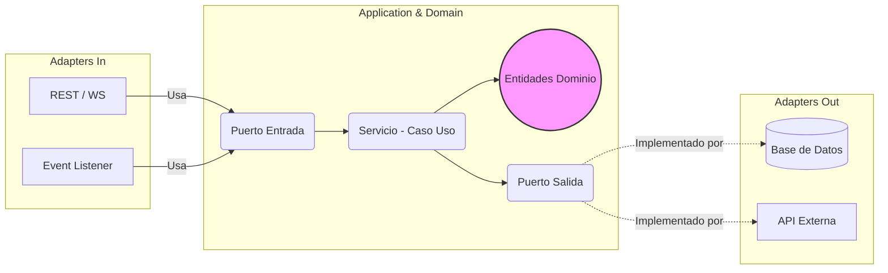
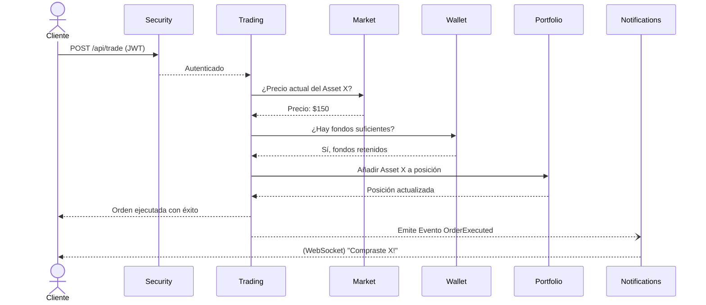
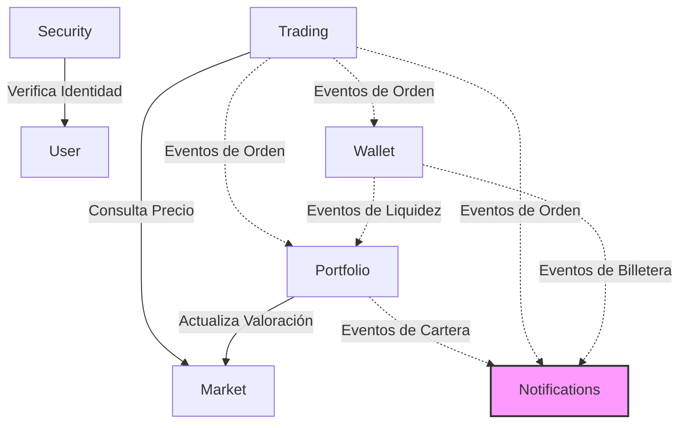

# EZTrade Backend

¡Bienvenido al backend de **EZTrade**! EZTrade es una plataforma de trading de simulación o ejecución diseñada con una arquitectura modular utilizando **Spring Boot** y **Spring Modulith**. Este enfoque garantiza un bajo acoplamiento y una alta cohesión, organizando el código en dominios lógicos de negocio.

---

## 🏗 Arquitectura y Módulos

El sistema está diseñado siguiendo los principios de la **Arquitectura Hexagonal** (también conocida como Puertos y Adaptadores) combinada con **Domain-Driven Design (DDD)**. Además, está organizado en módulos independientes utilizando **Spring Modulith** garantizando un bajo acoplamiento y una alta cohesión.

### ⬡ Arquitectura Hexagonal a nivel Módulo

Cada uno de los módulos de EZTrade implementa internamente una Arquitectura Hexagonal estricta estructurada de la siguiente manera:

- **Domain (`domain/`)**: Contiene la lógica central empresarial, entidades (ej. `TradeOrder`, `Position`), Value Objects y excepciones del dominio. No depende de ninguna capa exterior ni del framework.
- **Application (`application/`)**: Contiene los casos de uso (`services/`) y las interfaces (`ports/`).
  - **Ports In:** Definen las operaciones y casos de uso que el módulo expone hacia el exterior.
  - **Ports Out:** Definen los contratos que la capa de infraestructura deberá implementar (ej. persistir datos, llamar APIs externas).
- **Adapters (`adapter/`)**:
  - **Adapters In (`adapter/in/`):** Puntos de entrada al sistema como Controladores REST (`web/`), WebSockets (`ws/`) o Listeners de eventos (`events/`). Estás clases invocan los *Ports In*.
  - **Adapters Out (`adapter/out/`):** Implementaciones reales de infraestructura como repositorios de base de datos o adaptadores que consultan APIs externas. Estas clases implementan los *Ports Out*.



### Resumen de Módulos

El sistema está dividido en los siguientes módulos de dominio lógicos de negocio:

### 1. Market (Mercado)
- **Función:** Es la fuente de la verdad para los precios de los instrumentos financieros. Gestiona búsquedas de símbolos, entrega de precios actuales (MarketPrice) y datos históricos (Velas/Candles).
- **Workflow:** Recibe peticiones (REST/WS), consulta APIs externas o bases de datos locales, y devuelve los datos del mercado en tiempo real.

### 2. Trading (Operaciones)
- **Función:** Responsable de procesar las órdenes de compra y venta (TradeOrders).
- **Workflow:** El usuario solicita una orden. El módulo de Trading valida el precio de mercado actual (llamando a Market), verifica y bloquea los fondos/activos (interactuando con Wallet y Portfolio), y si todo es correcto, ejecuta la orden. Emite un evento `OrderExecutedEvent`.

### 3. Portfolio (Cartera)
- **Función:** Mantiene el registro de las posiciones de los usuarios (acciones o criptomonedas poseídas) y una proyección de lectura del valor total de su cartera y efectivo disponible.
- **Workflow:** Escucha los eventos del módulo de Trading para abrir o cerrar posiciones, y eventos de Wallet para mantener su vista de liquidez al día. Regularmente, solicita precios al módulo `Market` para actualizar la valoración de la cartera y emite el evento `PortfolioValuationUpdatedEvent`.

### 4. Wallet (Billetera)
- **Función:** Gestiona el balance de efectivo (fiat) de los usuarios (dinero disponible vs reservado). Procesa depósitos, retiros y retenciones de fondos. Es la **fuente de la verdad** del capital.
- **Workflow:** Escucha los eventos de Trading para descontar dinero en compras o añadir dinero en ventas. Emite eventos propios (como `AvailableCashUpdatedEvent`) para notificar al resto del sistema. Mantiene el historial inmutable de transacciones (WalletTransaction/Ledger).

### 5. Notifications (Notificaciones)
- **Función:** Sistema transversal encargado de alertar al usuario de lo que ocurre en su cuenta.
- **Workflow:** Funciona puramente por eventos. Escucha los eventos de dominio (como `PositionClosedEvent`, transacciones, alertas de precio) y empuja notificaciones (NotificationMessage) al cliente mediante WebSockets u otros canales.

### 6. User (Usuario)
- **Función:** Gestiona la identidad, perfiles y roles básicos del sistema.
- **Workflow:** Expone puertos para que otros módulos puedan consultar datos y preferencias del usuario.

### 7. Security (Seguridad)
- **Función:** Protege el acceso al servidor, gestiona la autenticación (Login) y la validación de tokens JWT.
- **Workflow:** Intercepta todas las llamadas HTTP. Consulta el módulo `User` a través de `LoadUserForSecurityPort` para verificar la identidad y permisos de acceso.

---

## 🔄 Flujo de Trabajo (Workflow General)

A continuación se muestra un diagrama que ilustra cómo una orden de compra fluye a través de los módulos de EZTrade:



---

## 🔗 Dependencias entre Módulos

El proyecto sigue las directrices de **Spring Modulith**, lo que significa que el grafo de dependencias está altamente controlado. A continuación se define qué módulo conoce a qué otro:



*Nota: Las líneas continuas indican invocaciones a nivel de código (Interfaces inyectadas / Puertos). Las líneas punteadas representan dependencias reventadas gobernadas por eventos de dominio (Asíncronos o Síncronos).*

---

## 🚀 Empezando con el Proyecto

Para compilar y correr el proyecto, incluyendo sus tests de arquitectura modulith:

1. **Prerrequisitos:**
   - Java 17 o superior.
   - Maven

2. **Compilar y saltar tests:**
   ```bash
   ./mvnw clean install -DskipTests
   ```

3. **Verificar estructura de los Módulos:**
   Puedes correr la prueba de estructura para generar la documentación de componentes de Modulith y asegurarte de que no hay saltos en las reglas de diseño arquitectónico:
   ```bash
   ./mvnw test -Dtest=ModulithStructureTest
   ```

4. **Arrancar en local:**
   ```bash
   ./mvnw spring-boot:run
   ```
