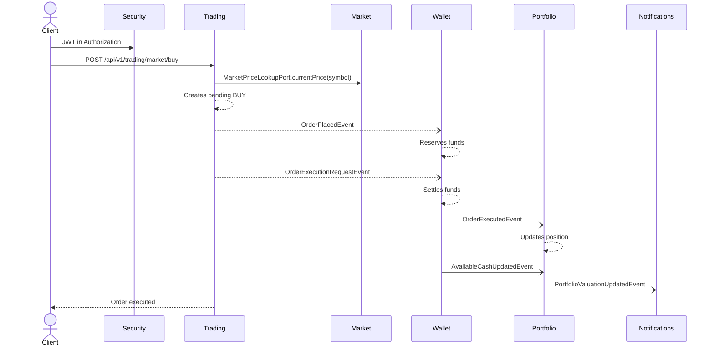

# EZTrade Backend

EZTrade backend built with Spring Boot, Spring Security, Spring Data JPA, and Spring Modulith. The project is organized by business modules, and each module follows a hexagonal architecture: domain, application, ports, and adapters.

## Architecture

Each module keeps this separation:

- `domain`: entities, value objects, events, and business exceptions. It does not depend on Spring or JPA.
- `application`: use cases and ports. It orchestrates the domain and defines what it needs from the outside.
- `adapter/in`: module entry points, such as REST controllers or event listeners.
- `adapter/out`: infrastructure, such as JPA repositories, Spring Events publishers, or external clients.
- `package-info.java`: Spring Modulith declaration and allowed dependencies.

## Modules

### User

Manages users, basic roles, and account registration.

- API: `POST /api/user/register`, `GET /api/user?email=...`
- Domain: `User`, `Role`
- Public ports for other modules: `user :: api`
- Persistence: `UserJpaEntity`, `JpaUserRepository`, `UserJpaMapper`

### Security

Manages login, JWT, HTTP filters, and authorization.

- Public API: `POST /auth/login`
- Filters: `JwtAuthFilter`, `UserAccessFilter`, `StompAuthChannelInterceptor`
- Configuration: `AuthenticationConfig`, `BeansConfig`, `WebSocketConfig`
- Depends on the user module through `LoadUserForSecurityPort`.

### Market

Retrieves market information from Alpha Vantage and exposes it through REST and through an internal API for other modules.

- REST API: `GET /api/v1/market/get-price`, `/search`, `/get-overview`, `/get-daily-candles`
- Internal API: `MarketPriceLookupPort`
- Adapters: `AlphaVantageAPI`, `CachedMarketDataProvider`
- Domain: `Symbol`, `MarketPrice`, `Instrument`, `InstrumentOverview`, `Candle`

### Trading

Manages orders, execution, and the user-to-user marketplace.

- Orders: `POST /api/v1/trading/orders`, `POST /api/v1/trading/orders/{orderId}/execute`, `POST /api/v1/trading/orders/{orderId}/cancel`, `GET /api/v1/trading/orders`
- Marketplace: `POST /api/v1/trading/market/buy`, `POST /api/v1/trading/offers`, `GET /api/v1/trading/offers`, `POST /api/v1/trading/offers/{offerId}/buy`
- Depends on `market :: api` to validate current prices.
- Publishes `OrderPlacedEvent`, `OrderExecutionRequestEvent`, and `OrderCancelledEvent`.

### Wallet

The source of truth for cash. It maintains available balance, reserved balance, and the ledger.

- REST API: `POST /api/v1/wallet/deposit`, `/withdraw`, `/transfer`, `GET /balance`, `GET /transactions`
- Reacts to trading events to reserve, release, and settle funds.
- Publishes wallet events such as `FundsReservedEvent`, `FundsSettledEvent`, `FundsReleasedEvent`, `InsufficientFundsEvent`, and `AvailableCashUpdatedEvent`.
- Uses pessimistic locking when modifying accounts.

### Portfolio

Maintains positions by user and symbol, realized PnL, projected cash, and market valuations.

- REST API: `GET /api/portfolio`
- Reacts to `OrderExecutedEvent` to open, increase, reduce, or close positions.
- Reacts to `AvailableCashUpdatedEvent` to synchronize available cash.
- Depends on `market :: api` to calculate current valuation in queries.

### Notifications

Transforms business events into user messages and distributes them through several channels.

- Channels: email/log, push/log, WebSocket STOMP, and persisted inbox.
- Listens to trading, wallet, and portfolio events.
- Common model: `NotificationMessage` and `NotificationType`.

## Main Market Buy Flow


```mermaid
sequenceDiagram
    actor Client
    participant Security
    participant Trading
    participant Market
    participant Wallet
    participant Portfolio
    participant Notifications

    Client->>Security: JWT in Authorization
    Client->>Trading: POST /api/v1/trading/market/buy
    Trading->>Market: MarketPriceLookupPort.currentPrice(symbol)
    Trading-->>Trading: Creates pending BUY
    Trading--)Wallet: OrderPlacedEvent
    Wallet-->>Wallet: Reserves funds
    Trading--)Wallet: OrderExecutionRequestEvent
    Wallet-->>Wallet: Settles funds
    Wallet--)Portfolio: OrderExecutedEvent
    Portfolio-->>Portfolio: Updates position
    Wallet-)Portfolio: AvailableCashUpdatedEvent
    Portfolio-)Notifications: PortfolioValuationUpdatedEvent
    Trading-->>Client: Order executed
```

## Commands

```bash
./mvnw test
./mvnw spring-boot:run
```

On Windows:

```powershell
.\mvnw.cmd test
.\mvnw.cmd spring-boot:run
```

## Module Documentation

Each module contains its own `.md` file next to the code:

- `src/main/java/com/trading/platform/eztrade/user/user.md`
- `src/main/java/com/trading/platform/eztrade/security/security.md`
- `src/main/java/com/trading/platform/eztrade/market/market.md`
- `src/main/java/com/trading/platform/eztrade/trading/trading.md`
- `src/main/java/com/trading/platform/eztrade/wallet/wallet.md`
- `src/main/java/com/trading/platform/eztrade/portfolio/portfolio.md`
- `src/main/java/com/trading/platform/eztrade/notifications/notifications.md`
