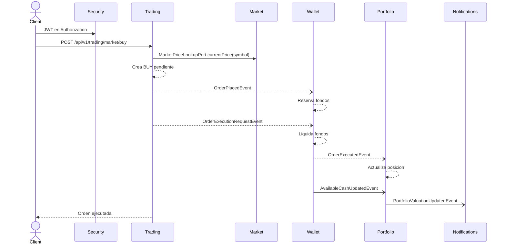

# EZTrade Backend

Backend de EZTrade construido con Spring Boot, Spring Security, Spring Data JPA y Spring Modulith. El proyecto se organiza por modulos de negocio y cada modulo sigue arquitectura hexagonal: dominio, aplicacion, puertos y adaptadores.

## Arquitectura

Cada modulo mantiene esta separacion:

- `domain`: entidades, value objects, eventos y excepciones de negocio. No depende de Spring ni JPA.
- `application`: casos de uso y puertos. Orquesta el dominio y define que necesita de fuera.
- `adapter/in`: entradas al modulo, como controladores REST o listeners de eventos.
- `adapter/out`: infraestructura, como repositorios JPA, publicadores Spring Events o clientes externos.
- `package-info.java`: declaracion Spring Modulith y dependencias permitidas.

## Modulos

### User

Gestiona usuarios, roles basicos y alta de cuentas.

- API: `POST /api/user/register`, `GET /api/user?email=...`
- Dominio: `User`, `Role`
- Puertos publicos para otros modulos: `user :: api`
- Persistencia: `UserJpaEntity`, `JpaUserRepository`, `UserJpaMapper`

### Security

Gestiona login, JWT, filtros HTTP y autorizacion.

- API publica: `POST /auth/login`
- Filtros: `JwtAuthFilter`, `UserAccessFilter`, `StompAuthChannelInterceptor`
- Configuracion: `AuthenticationConfig`, `BeansConfig`, `WebSocketConfig`
- Depende del modulo user mediante `LoadUserForSecurityPort`.

### Market

Consulta informacion de mercado desde AlphaVantage y la expone por REST y por una API interna para otros modulos.

- API REST: `GET /api/v1/market/get-price`, `/search`, `/get-overview`, `/get-daily-candles`
- API interna: `MarketPriceLookupPort`
- Adaptadores: `AlphaVantageAPI`, `CachedMarketDataProvider`
- Dominio: `Symbol`, `MarketPrice`, `Instrument`, `InstrumentOverview`, `Candle`

### Trading

Gestiona ordenes, ejecucion y marketplace entre usuarios.

- Ordenes: `POST /api/v1/trading/orders`, `POST /api/v1/trading/orders/{orderId}/execute`, `POST /api/v1/trading/orders/{orderId}/cancel`, `GET /api/v1/trading/orders`
- Marketplace: `POST /api/v1/trading/market/buy`, `POST /api/v1/trading/offers`, `GET /api/v1/trading/offers`, `POST /api/v1/trading/offers/{offerId}/buy`
- Depende de `market :: api` para validar precios actuales.
- Publica `OrderPlacedEvent`, `OrderExecutionRequestEvent` y `OrderCancelledEvent`.

### Wallet

Es la fuente de verdad del efectivo. Mantiene saldo disponible, saldo reservado y ledger.

- API REST: `POST /api/v1/wallet/deposit`, `/withdraw`, `/transfer`, `GET /balance`, `GET /transactions`
- Reacciona a eventos de trading para reservar, liberar y liquidar fondos.
- Publica eventos de wallet como `FundsReservedEvent`, `FundsSettledEvent`, `FundsReleasedEvent`, `InsufficientFundsEvent` y `AvailableCashUpdatedEvent`.
- Usa bloqueo pesimista al modificar cuentas.

### Portfolio

Mantiene posiciones por usuario y simbolo, PnL realizado, cash proyectado y valoraciones de mercado.

- API REST: `GET /api/portfolio`
- Reacciona a `OrderExecutedEvent` para abrir, aumentar, reducir o cerrar posiciones.
- Reacciona a `AvailableCashUpdatedEvent` para sincronizar cash disponible.
- Depende de `market :: api` para calcular valoracion actual en consultas.

### Notifications

Transforma eventos de negocio en mensajes de usuario y los distribuye por varios canales.

- Canales: email/log, push/log, WebSocket STOMP e inbox persistido.
- Escucha eventos de trading, wallet y portfolio.
- Modelo comun: `NotificationMessage` y `NotificationType`.

## Flujo principal de compra al mercado


```mermaid
sequenceDiagram
    actor Client
    participant Security
    participant Trading
    participant Market
    participant Wallet
    participant Portfolio
    participant Notifications

    Client->>Security: JWT en Authorization
    Client->>Trading: POST /api/v1/trading/market/buy
    Trading->>Market: MarketPriceLookupPort.currentPrice(symbol)
    Trading-->>Trading: Crea BUY pendiente
    Trading--)Wallet: OrderPlacedEvent
    Wallet-->>Wallet: Reserva fondos
    Trading--)Wallet: OrderExecutionRequestEvent
    Wallet-->>Wallet: Liquida fondos
    Wallet--)Portfolio: OrderExecutedEvent
    Portfolio-->>Portfolio: Actualiza posicion
    Wallet-)Portfolio: AvailableCashUpdatedEvent
    Portfolio-)Notifications: PortfolioValuationUpdatedEvent
    Trading-->>Client: Orden ejecutada
```

## Comandos

```bash
./mvnw test
./mvnw spring-boot:run
```

En Windows:

```powershell
.\mvnw.cmd test
.\mvnw.cmd spring-boot:run
```

## Documentacion por modulo

Cada modulo contiene su propio `.md` junto al codigo:

- `src/main/java/com/trading/platform/eztrade/user/user.md`
- `src/main/java/com/trading/platform/eztrade/security/security.md`
- `src/main/java/com/trading/platform/eztrade/market/market.md`
- `src/main/java/com/trading/platform/eztrade/trading/trading.md`
- `src/main/java/com/trading/platform/eztrade/wallet/wallet.md`
- `src/main/java/com/trading/platform/eztrade/portfolio/portfolio.md`
- `src/main/java/com/trading/platform/eztrade/notifications/notifications.md`
