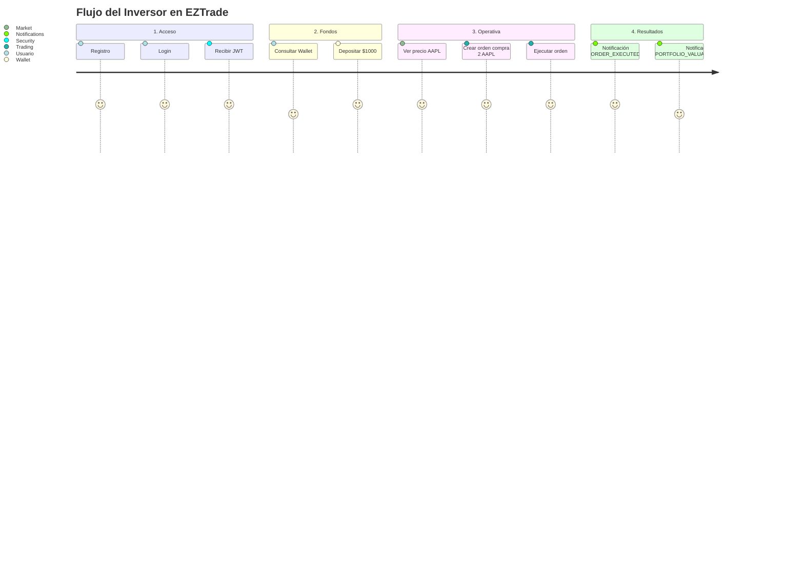
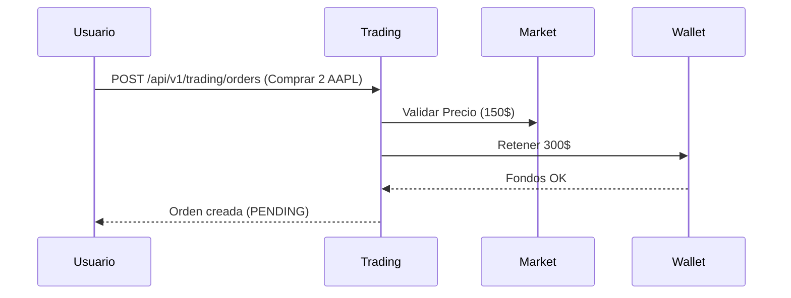

# EZTrade - Demo Completa 🚀

Bienvenido a la demostración interactiva de **EZTrade**. En este documento te guiaremos paso a paso a través de un flujo completo para validar el funcionamiento integral de la arquitectura modular de la plataforma.

> 💡 **Tip:** Para ejecutar todas las peticiones automáticamente y probar la demo sin salir del IDE, abre el archivo [demo.http](demo.http) y utiliza los botones de "Play" (▶️) del HTTP Client de JetBrains.

## 🎯 Objetivo del Flujo

Realizaremos la trayectoria típica de un inversor en EZTrade:
1. **Registro:** Crear una nueva cuenta de usuario en la plataforma.
2. **Autenticación:** Iniciar sesión y obtener un token JWT.
3. **Billetera:** Consultar fondos y depositar dinero.
4. **Mercado:** Consultar el precio en tiempo real de un instrumento (ej. AAPL).
5. **Trading:** Crear y ejecutar una orden de compra para adquirir acciones.
6. **Notificaciones:** Confirmar la ejecución y la actualización de cartera vía eventos notificados.

---

## 🗺 Diagrama de la Demo



---

## 🛠 Paso a Paso

### Paso 0: Registro (Sign Up)
Antes de poder iniciar sesión, necesitamos crear un usuario en el sistema.

**Petición HTTP:**
```http
POST /api/user/register
Content-Type: application/json

{
  "firstname": "Demo",
  "lastname": "User",
  "username": "demoUser",
  "email": "demo@example.com",
  "password": "password123"
}
```

**Respuesta Esperada:**
```json
{
  "firstname": "Demo",
  "lastname": "User",
  "username": "demoUser",
  "email": "demo@example.com",
  "password": "$2a$10$Oi1Ehb0gN28qry258oGelOuoAVCHE.Oj8G30ypFjzSSBok8dgtgwy"
}
```

### Paso 1: Autenticación (Login)
Ahora que el usuario existe, nos autenticamos para obtener un **Token JWT**.

Puedes autenticarte usando **email** o **username**.

**Petición HTTP:**
```http
POST /auth/login
Content-Type: application/json

{
  "email": "demo@example.com",
  "password": "password123"
}
```

**Alternativa con username:**
```http
POST /auth/login
Content-Type: application/json

{
  "username": "demoUser",
  "password": "password123"
}
```

**Respuesta Esperada:**
```json
{
  "token": "eyJhbGciOiJIUzI1NiIsInR5cCI6IkpXVCJ9...",
  "type": "Bearer"
}
```
> ⚠️ **Nota:** A partir de aquí, todas las peticiones deben incluir la cabecera `Authorization: Bearer <tú_token>`.

### Paso 2: Consultar y Depositar Fondos en el Wallet
Antes de operar, nos aseguramos de tener dinero fiduciario disponible.

**Petición para Depositar:**
```http
POST /api/v1/wallet/deposit
Authorization: Bearer <token>
Content-Type: application/json

{
  "amount": 1000.00,
  "referenceId": "demo-deposit-001",
  "description": "Ingreso inicial para demo"
}
```

**Consultar Balance:**
```http
GET /api/v1/wallet/balance
Authorization: Bearer <token>
```
*El sistema deberá devolver un balance disponible de 1000.00 y reservado de 0.00.*

### Paso 3: Consultar el Mercado (Market)
Vamos a buscar el precio actual de la acción de Apple (AAPL) antes de comprar.

**Petición:**
```http
GET /api/v1/market/get-price?symbol=AAPL
Authorization: Bearer <token>
```

**Respuesta Simulada:**
```json
{
  "symbol": "AAPL",
  "price": 150.00,
  "timestamp": "2026-03-24T10:00:00Z"
}
```

### Paso 4: Ejecutar una Orden de Compra (Trading)
Decidimos comprar 2 acciones de AAPL con precio 150. La operación costará aproximadamente $300.



**Petición:**
```http
POST /api/v1/trading/orders
Authorization: Bearer <token>
Content-Type: application/json

{
  "symbol": "AAPL",
  "side": "BUY",
  "quantity": 2,
  "price": 150
}
```

### Paso 5: Ejecutar la Orden
Con el `id` devuelto en la creación, ejecutamos la orden para disparar los eventos de dominio.

**Petición:**
```http
POST /api/v1/trading/orders/{orderId}/execute
Authorization: Bearer <token>
```

### Paso 6: Verificar resultado desde Notifications
La confirmación del resultado del trade se observa desde el módulo **notifications** (no desde un endpoint REST de portfolio en esta demo).

Se esperan al menos estas notificaciones:
- `ORDER_EXECUTED`: confirma que la orden se ejecutó.
- `PORTFOLIO_VALUATION_UPDATED`: confirma actualización agregada de cartera.

Canales disponibles en el backend actual:
- Logs (`LoggingEmailNotificationAdapter` y `LoggingPushNotificationAdapter`).
- WebSocket usuario en `/user/queue/notifications` (si hay broker/cliente conectado).
- Inbox persistido en BD (adaptador `InboxNotificationAdapter`).

**Respuesta Esperada:**
```json
{
  "type": "ORDER_EXECUTED",
  "title": "Orden ejecutada",
  "body": "La orden #123 fue ejecutada: BUY 2 AAPL @ 150.",
  "occurredAt": "2026-03-24T10:05:00"
}
```

*Tras la ejecución, si consultas `GET /api/v1/wallet/balance`, el balance disponible debe reflejar el débito asociado (aprox. `$700.00`).*

### Paso 7: Observar Notificaciones en Tiempo Real
En el momento exacto en que la orden se ejecutó en el Paso 5, el módulo de **Trading** emitió un `OrderExecutedEvent`. El módulo de **Notifications** lo capturó.

Si estuviéramos conectados por **WebSocket**, nuestro cliente recibiría un mensaje similar a este:

```json
{
  "type": "ORDER_EXECUTED",
  "message": "Tu orden de compra de 2 AAPL se ha ejecutado a 150.00$",
  "timestamp": "2026-03-24T10:05:00Z"
}
```

---

## 📌 Conclusión
A través de este flujo hemos comprobado que los 7 módulos del sistema se comunican de forma efectiva, manteniendo sus responsabilidades separadas pero cooperando mediante **Puertos/Adaptadores** y **Eventos de Dominio** para brindar una experiencia de trading completa.
