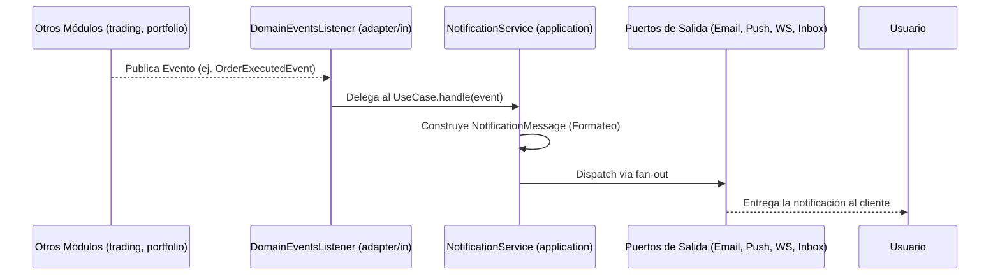

# Módulo Notifications

## 1. Visión General

El módulo **Notifications** (Notificaciones) es el encargado de comunicar al usuario los distintos eventos relevantes que ocurren en la plataforma (por ejemplo, cuando se registra, ejecuta o cancela una orden, o cuando se actualiza el balance de la cartera).

### 1.1. Responsabilidades y Límites
- **Reactivo**: Reacciona a eventos asíncronos emitidos por otros módulos transaccionales (`trading`, `portfolio`).
- **Agnóstico del canal**: Transforma reglas y eventos de negocio en un formato genérico legible para el usuario.
- **Fan-Out multicanal**: Orquesta el envío de un mismo mensaje simultáneamente a diferentes canales (Email, Push, WebSocket, Inbox).
- **Aislado**: **No tiene ninguna lógica de trading o portafolio**. No decide si una orden es válida o no, únicamente notifica los resultados.

---

## 2. Flujo de Trabajo (Workflow)

El módulo utiliza una arquitectura guiada por eventos que sigue este patrón unidireccional:



1. Un evento es publicado por otro módulo bajo el paraguas de procesos de Spring (`ApplicationEventPublisher`).
2. El listener de entrada atrapa el evento.
3. El servicio de aplicación formatea los datos del evento hacia un `NotificationMessage`.
4. El mensaje es enviado ("fan-out") hacia cuatro canales de salida mediante interfaces de puertos.

---

## 3. Clases Principales y Responsabilidades

Todo el código está diseñado bajo **Arquitectura Hexagonal (Ports & Adapters)**.

### 3.1 Capa de Dominio (`domain`)

Es la encargada de establecer el modelo genérico que consumirán todos los canales, para evitar acoplar los puertos de salida a los eventos iniciales.

#### `NotificationMessage.java`
Representa el mensaje estándar listo para ser renderizado.
```java
public record NotificationMessage(
        String recipient,         // Destinatario (ej. email o user handler)
        NotificationType type,    // Categoría de la notificación
        String title,             // Título UI
        String body,              // Cuerpo descriptivo (formateado)
        LocalDateTime occurredAt  // Marca de tiempo del evento original
) { }
```

#### `NotificationType.java`
Un enumerado que tipifica cada mensaje. Permite que en el front-end o en futuras funcionalidades el usuario filtre por categorías.
```java
public enum NotificationType {
    ORDER_PLACED,
    ORDER_EXECUTED,
    ORDER_CANCELLED,
    PORTFOLIO_VALUATION_UPDATED
}
```

---

### 3.2 Capa de Aplicación (`application`)

Esta capa orquesta la entrada de datos, su traducción de "evento" a "mensaje" y la delegación hacia la infraestructura.

#### `NotifyOnDomainEventsUseCase.java` (Port de Entrada)
Define el contrato sobre los eventos que este módulo está capacitado para consumir.
```java
public interface NotifyOnDomainEventsUseCase {
    void handle(OrderPlacedEvent event);
    void handle(OrderExecutedEvent event);
    void handle(OrderCancelledEvent event);
    void handle(PortfolioValuationUpdatedEvent event);
}
```

#### `NotificationService.java` (Servicio Principal)
Implementa el caso de uso anterior. Su responsabilidad principal es construir un mensaje humanamente legible y llamar a método privado `dispatch()` para distribuirlo a todos los puertos de salida.

```java
@Service
public class NotificationService implements NotifyOnDomainEventsUseCase {
    
    // Inyección de los puertos de salida para los 4 canales
    private final EmailNotificationPort emailNotificationPort;
    private final PushNotificationPort pushNotificationPort;
    // ...

    @Override
    public void handle(OrderExecutedEvent event) {
        // 1. Transformación (Formateo)
        NotificationMessage message = new NotificationMessage(
                event.owner(),
                NotificationType.ORDER_EXECUTED,
                "Orden ejecutada",
                "La orden #" + event.orderId() + " fue ejecutada: " + event.side() + " " + event.symbol(),
                event.occurredAt()
        );
        // 2. Transmisión
        dispatch(message);
    }

    private void dispatch(NotificationMessage message) {
        emailNotificationPort.send(message);         // Envía por Email
        pushNotificationPort.send(message);          // Envía Push móvil
        webSocketNotificationPort.send(message);     // Envía a web activa (STOMP)
        inboxNotificationPort.save(message);         // Persiste en BD (Historial)
    }
}
```

---

### 3.3 Adaptadores de Entrada (`adapter/in`)

Son los conectores que perciben la intención externa e invocan a la capa de aplicación.

#### `DomainEventsListener.java`
Traduce mecanismos de Spring (métodos con `@EventListener`) a puras invocaciones de arquitectura limpia.

```java
@Component
public class DomainEventsListener {

    private final NotifyOnDomainEventsUseCase useCase;

    @EventListener
    public void on(OrderPlacedEvent event) {
        useCase.handle(event);
    }
    // ... otros listeners similares
}
```

---

### 3.4 Adaptadores de Salida (`adapter/out`)

Dentro de la capa `application/ports/out/` se definen interfaces (`XXXXNotificationPort`). Estas implementaciones residen en los adaptadores de salida.

#### `LoggingEmailNotificationAdapter.java` y `LoggingPushNotificationAdapter.java`
Actualmente son implementaciones "dummy" genéricas que escriben en consola. Serán reemplazables en el futuro integrando SDKs de SendGrid, AWS SES, Firebase o APNS sin tocar ni una sola línea o regla de negocio del núcleo.

```java
@Component
public class LoggingEmailNotificationAdapter implements EmailNotificationPort {
    @Override
    public void send(NotificationMessage message) {
         log.info("EMAIL to={} title={} ... ", message.recipient(), message.title());
    }
}
```

#### `WebSocketNotificationAdapter.java`
Conector en tiempo real con Spring WebSockets + STOMP. Solo interactúa si la conexión Web Sockets está habilitada.
```java
@Component
public class WebSocketNotificationAdapter implements WebSocketNotificationPort {

    private final ObjectProvider<SimpMessagingTemplate> templateProvider;

    @Override
    public void send(NotificationMessage message) {
        SimpMessagingTemplate template = templateProvider.getIfAvailable();
        if (template != null) {
            template.convertAndSendToUser(
                message.recipient(), 
                "/queue/notifications", 
                Map.of("title", message.title(), "body", message.body()) // payload
            );
        }
    }
}
```

#### `InboxNotificationAdapter.java` + Entidades JPA
Mantiene la persistencia para el "Centro de Notificaciones in-app" en base de datos.
```java
@Repository
public class InboxNotificationAdapter implements InboxNotificationPort {

    private final SpringDataInboxNotificationRepository repository;

    @Override
    public void save(NotificationMessage message) {
        InboxNotificationJpaEntity entity = new InboxNotificationJpaEntity();
        entity.setRecipient(message.recipient());
        entity.setBody(message.body());
        entity.setRead(false); // Por defecto nuevo =  no leído
        repository.save(entity);
    }
}
```
