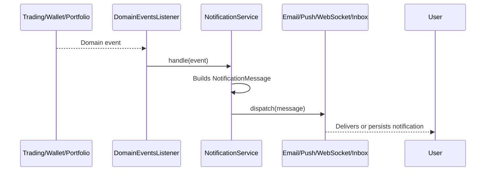

# Notifications Module

## Purpose

`notifications` converts business events into user-readable messages and delivers them through several channels. It does not decide trading, wallet, or portfolio rules: it only reports what has already happened.

## Domain

- `NotificationMessage`: normalized message with recipient, type, title, body, and date.
- `NotificationType`: classifies messages as `ORDER_PLACED`, `ORDER_EXECUTED`, `ORDER_CANCELLED`, `INSUFFICIENT_FUNDS`, and `PORTFOLIO_VALUATION_UPDATED`.

## Application

`NotifyOnDomainEventsUseCase` defines the events that the module knows how to transform.

`NotificationService`:

1. receives an event,
2. builds a `NotificationMessage`,
3. calls `dispatch(...)`,
4. sends the same message to all output ports.

## Events Consumed

- `OrderPlacedEvent`
- `OrderExecutedEvent`
- `OrderCancelledEvent`
- `InsufficientFundsEvent`
- `PortfolioValuationUpdatedEvent`

The input adapter is `DomainEventsListener`, which uses `@EventListener` to delegate each event to the use case.

## Output Channels

- `EmailNotificationPort`: implemented by `LoggingEmailNotificationAdapter`.
- `PushNotificationPort`: implemented by `LoggingPushNotificationAdapter`.
- `WebSocketNotificationPort`: implemented by `WebSocketNotificationAdapter`.
- `InboxNotificationPort`: implemented by `InboxNotificationAdapter`.

The current email and push channels write to logs. WebSocket uses STOMP when `SimpMessagingTemplate` exists. Inbox persists messages in `notification_inbox`.

## Persistence

- `InboxNotificationJpaEntity`: inbox entity.
- `SpringDataInboxNotificationRepository`: Spring Data repository.
- `InboxNotificationAdapter`: transforms `NotificationMessage` into a JPA entity and saves it as unread.

## Flow

```mermaid
sequenceDiagram
    participant Module as Trading/Wallet/Portfolio
    participant Listener as DomainEventsListener
    participant Service as NotificationService
    participant Ports as Email/Push/WebSocket/Inbox
    participant User

    Module-->>Listener: Domain event
    Listener->>Service: handle(event)
    Service->>Service: Builds NotificationMessage
    Service->>Ports: dispatch(message)
    Ports-->>User: Delivers or persists notification
```

## Maintenance Rule

If a new user-relevant event is added, update:

- `NotificationType`,
- `NotifyOnDomainEventsUseCase`,
- `NotificationService`,
- `DomainEventsListener`,
- this document.
