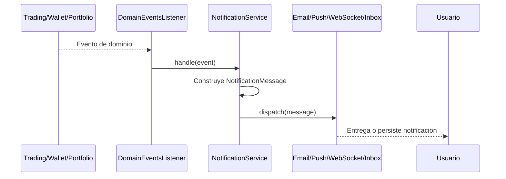

# Modulo Notifications

## Proposito

`notifications` convierte eventos de negocio en mensajes legibles para el usuario y los entrega por varios canales. No decide reglas de trading, wallet o portfolio: solo informa de lo que ya ocurrio.

## Dominio

- `NotificationMessage`: mensaje normalizado con destinatario, tipo, titulo, cuerpo y fecha.
- `NotificationType`: clasifica mensajes como `ORDER_PLACED`, `ORDER_EXECUTED`, `ORDER_CANCELLED`, `INSUFFICIENT_FUNDS` y `PORTFOLIO_VALUATION_UPDATED`.

## Aplicacion

`NotifyOnDomainEventsUseCase` define los eventos que el modulo sabe transformar.

`NotificationService`:

1. recibe un evento,
2. construye un `NotificationMessage`,
3. llama a `dispatch(...)`,
4. envia el mismo mensaje a todos los puertos de salida.

## Eventos consumidos

- `OrderPlacedEvent`
- `OrderExecutedEvent`
- `OrderCancelledEvent`
- `InsufficientFundsEvent`
- `PortfolioValuationUpdatedEvent`

El adaptador de entrada es `DomainEventsListener`, que usa `@EventListener` para delegar cada evento en el caso de uso.

## Canales de salida

- `EmailNotificationPort`: implementado por `LoggingEmailNotificationAdapter`.
- `PushNotificationPort`: implementado por `LoggingPushNotificationAdapter`.
- `WebSocketNotificationPort`: implementado por `WebSocketNotificationAdapter`.
- `InboxNotificationPort`: implementado por `InboxNotificationAdapter`.

Los canales de email y push actuales escriben en logs. WebSocket usa STOMP cuando existe `SimpMessagingTemplate`. Inbox persiste mensajes en `notification_inbox`.

## Persistencia

- `InboxNotificationJpaEntity`: entidad de la bandeja.
- `SpringDataInboxNotificationRepository`: repositorio Spring Data.
- `InboxNotificationAdapter`: transforma `NotificationMessage` en entidad JPA y la guarda como no leida.

## Flujo

```mermaid
sequenceDiagram
    participant Module as Trading/Wallet/Portfolio
    participant Listener as DomainEventsListener
    participant Service as NotificationService
    participant Ports as Email/Push/WebSocket/Inbox
    participant User as Usuario

    Module-->>Listener: Evento de dominio
    Listener->>Service: handle(event)
    Service->>Service: Construye NotificationMessage
    Service->>Ports: dispatch(message)
    Ports-->>User: Entrega o persiste notificacion
```

## Regla de mantenimiento

Si se anade un nuevo evento relevante para el usuario, deben actualizarse:

- `NotificationType`,
- `NotifyOnDomainEventsUseCase`,
- `NotificationService`,
- `DomainEventsListener`,
- este documento.
