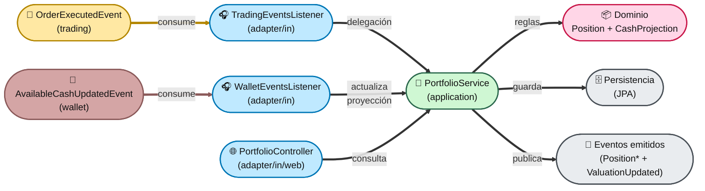
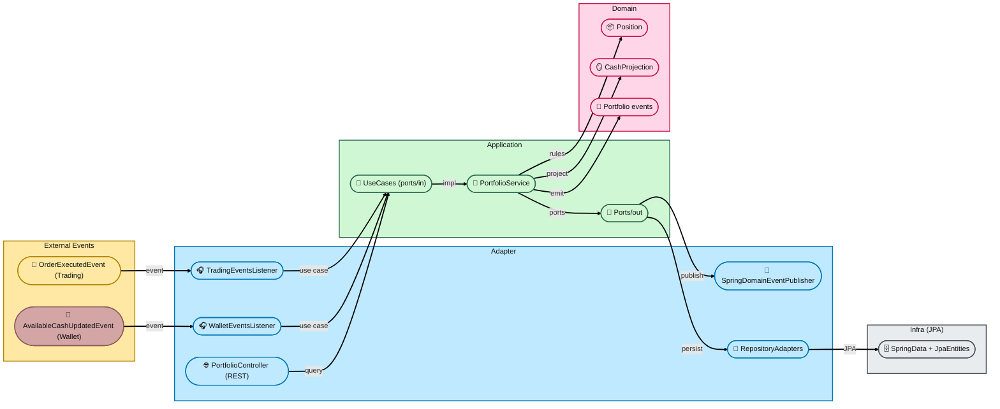
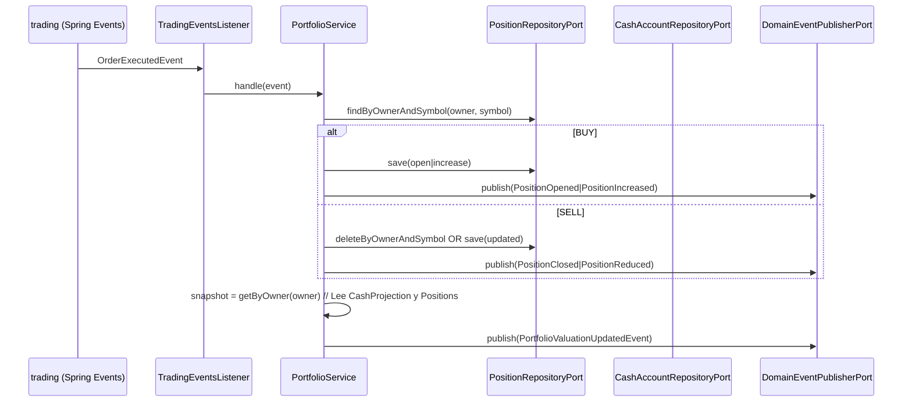

# Módulo `portfolio`

> **Ubicación**: `src/main/java/com/trading/platform/eztrade/portfolio/`

Este módulo modela y mantiene la **cartera** de un usuario:

* **Posiciones** por símbolo (cantidad, coste medio y PnL realizado).
* **Cash disponible** (mediante una proyección local de sólo lectura sincronizada con el módulo de `wallet`).
* Reacciona a ejecuciones de órdenes emitidas por `trading`.
* Publica eventos cuando cambian posiciones y cuando se recalcula una “valoración” agregada de la cartera.

La descripción oficial del módulo y sus límites están en `portfolio/package-info.java` (líneas **1–20**).

---

## 1) Responsabilidades y límites (qué hace / qué NO hace)

### ✅ Responsabilidades

Según `portfolio/package-info.java` (**4–10**), portfolio:

1. Mantiene posiciones por usuario y símbolo.
2. Contiene una vista del cash disponible por usuario basada en eventos del módulo `wallet`.
3. Reacciona a eventos de ejecución de órdenes (`trading`).
4. Publica eventos de cambios de posición y de valoración agregada.

### ❌ Fuera de alcance

Según `portfolio/package-info.java` (**12–16**):

* No ejecuta órdenes (pertenece a `trading`).
* No consulta precios de mercado directamente (no hay dependencia directa con `market`).
* No decide la mutación real del cash del usuario de manera transaccional. Esto es propiedad exclusiva de `wallet`.

### Dependencias permitidas (Spring Modulith)

El módulo está declarado como `@ApplicationModule` con:

* `allowedDependencies = {"trading :: events", "wallet :: events"}`

en `portfolio/package-info.java` (**18–20**). Es decir: **portfolio sólo puede depender de submódulos de eventos tanto de trading como de wallet**.

---

## 2) Arquitectura: Hexagonal (Ports & Adapters)

Este módulo sigue una separación típica:

* **Dominio** (`portfolio/domain`): reglas de negocio puras.
* **Aplicación** (`portfolio/application`): orquestación y casos de uso.
* **Adaptadores** (`portfolio/adapter`): entradas (eventos de trading y wallet) y salidas (persistencia + publicación de eventos).

### 2.1. Vista de componentes (alto nivel)

> Si prefieres una vista “arquitectónica” por capas (más detallada), ver **Vista por capas** a continuación.

#### Vista por capas (swimlanes coloreadas)

Referencias:

* Entrada por evento de trading: `adapter/in/events/TradingEventsListener.java`.
* Entrada por evento de wallet: `adapter/in/events/WalletEventsListener.java`.
* Caso de uso real: `application/services/PortfolioService.java`.
* Puertos de salida: `application/ports/out/*.java`.
* Dominio: `domain/Position.java`, `domain/CashProjection.java`.

---

## 3) Flujo principal: “una orden se ejecuta → portfolio se actualiza”

### 3.1. Entrada: `OrderExecutedEvent` (desde `trading`)

`trading` publica el evento `OrderExecutedEvent` (vía Spring Events). Portfolio lo consume con:

* `TradingEventsListener.on(OrderExecutedEvent event)` en `adapter/in/events/TradingEventsListener.java` (**20–23**), que simplemente delega al caso de uso de aplicación.

La lógica completa está en `application/services/PortfolioService.java`:

* Normalización y validaciones base.
* Ruteo por lado BUY/SELL, enfocado puramente en la **creación/actualización de posiciones**.
* Publicación del evento de valoración agregada, leyendo la proyección del cash.

---

## 4) Reglas de negocio (Dominio)

### 4.1. `Position`: cantidad, coste medio y PnL realizado

Archivo: `domain/Position.java`.

Representa una posición **por** `(owner, symbol)`.

**Atributos principales** (líneas **13–18**):

* `quantity`: unidades actuales.
* `averageCost`: coste medio ponderado.
* `realizedPnl`: PnL realizado acumulado.
* `updatedAt`: marca temporal del último cambio.

**Operaciones de negocio**:

* `open(owner, symbol, quantity, executionPrice)` (**34–38**)
  * Abre una posición nueva.
  * Invariante: cantidad y precio deben ser > 0 (**35–36**).

* `increase(quantityToAdd, executionPrice)` (**49–60**)
  * Recalcula el coste medio ponderando coste actual + coste añadido.
  * Fórmula: `newAverageCost = (currentCost + addedCost) / newQuantity` (**53–58**).

* `reduce(quantityToSell, executionPrice)` (**62–87**)
  * Vende parcialmente o cierra.
  * Invariante: no se puede vender más de lo que hay (**66–68**).
  * Cálculo PnL realizado incremental:
	* `realizedDelta = (executionPrice - averageCost) * quantityToSell` (**70–71**).
  * Si se cierra (cantidad 0) el coste medio se pone a 0 (**73–76**).
  * Devuelve `SellResult(position, realizedPnlDelta)` (**86–87**, **121–122**).

**Consultas auxiliares**:

* `investedAmount()` = `quantity * averageCost`.
* `isClosed()` = `quantity == 0`.

### 4.2. `CashProjection`: réplica del cash disponible basada en eventos

Archivo: `domain/CashProjection.java`.

A diferencia de las posiciones que sufren mutaciones de dominio aquí, el módulo `portfolio` **no cambia** activamente el cash. Simplemente mantiene un modelo de *read-only* (proyección local) que se sincroniza escuchando eventos emitidos por el módulo `wallet`.

Al reaccionar ante el evento `AvailableCashUpdatedEvent` de `wallet`, `PortfolioService` extrae la información de dominio y guarda un record de la `CashProjection` actualizando un timestamp.

### 4.3. Excepciones de dominio

* `domain/PortfolioDomainException.java` (**6–11**): excepción runtime para violaciones de invariantes.

---

## 5) Capa de aplicación: casos de uso y orquestación

### 5.1. Puertos de entrada (Use Cases)

Ubicación: `application/ports/in`.

* `HandleOrderExecutedUseCase` (`handle(OrderExecutedEvent event)`) en `HandleOrderExecutedUseCase.java`.
  * Es el contrato que permite que un adaptador de entrada (listener de eventos) invoca la lógica.

* `HandleWalletCashUpdatedUseCase` (`handle(AvailableCashUpdatedEvent event)`) en `HandleWalletCashUpdatedUseCase.java`.
  * Contrato usado para actualizar la proyección del estado de liquidez emitido desde `wallet`.

* `GetPortfolioUseCase` (`getByOwner(String owner)`) en `GetPortfolioUseCase.java`.
  * Contrato de lectura (consulta) de la cartera agregada.

### 5.2. Servicio de aplicación: `PortfolioService`

Archivo: `application/services/PortfolioService.java`.

Implementa ambos casos de uso:

* `implements HandleOrderExecutedUseCase, GetPortfolioUseCase, HandleWalletCashUpdatedUseCase`.

#### Método principal: `handle(OrderExecutedEvent event)`

Se encarga de:

1. Extraer/normalizar datos del evento (`owner`, `symbol`, `quantity`, `price`).
2. Mapear y ejecutar rama BUY o SELL llamando a submétodos privados que actúan exclusivamente sobre repositorios de persistencia *Position*.
3. Recalcular snapshot agregada (accediendo a la `CashProjection`) y publicar `PortfolioValuationUpdatedEvent`.

#### Rama BUY: `handleBuy(...)`

* Si no existe posición → `Position.open(...)` y publica `PositionOpenedEvent`.
* Si existe → `current.increase(...)` y publica `PositionIncreasedEvent`.

#### Rama SELL: `handleSell(...)`

* Requiere posición existente o lanza `PortfolioDomainException`.
* Aplica reducción/cierre con `current.reduce(...)`.
* Si queda cerrada → elimina en repositorio y publica `PositionClosedEvent`.
* Si queda abierta → guarda y publica `PositionReducedEvent`.

#### Método sincronización de balance: `handle(AvailableCashUpdatedEvent event)`

* Recibe el evento emitido por `wallet`, valida parámetros.
* Actualiza o crea el persistente `CashProjection` mediante el repositorio.

#### Lectura agregada: `getByOwner(owner)`

* Carga todas las posiciones (`findByOwner`).
* Suma:
  * `totalCostBasis`: suma de `Position::investedAmount`.
  * `totalRealizedPnl`: suma de `Position::realizedPnl`.
* Lee `cashAvailable` desde la base de datos a través de la interfaz proyectada de `CashProjection` (o devuelve 0).
* Devuelve `PortfolioSnapshot`.

---

## 6) Puertos de salida (dependencias externas)

Ubicación: `application/ports/out`.

### 6.1. Persistencia de posiciones: `PositionRepositoryPort`

Archivo: `application/ports/out/PositionRepositoryPort.java` (**8–17**):

* `findByOwnerAndSymbol(owner, symbol)`
* `findByOwner(owner)`
* `save(position)`
* `deleteByOwnerAndSymbol(owner, symbol)`

### 6.2. Persistencia de la proyección de cash: `CashProjectionRepositoryPort`

Archivo: `application/ports/out/CashProjectionRepositoryPort.java`:

* `findByOwner(owner)`
* `save(projection)`

### 6.3. Publicación de eventos: `DomainEventPublisherPort`

Archivo: `application/ports/out/DomainEventPublisherPort.java` (**3–6**):

* `publish(Object event)`

Este puerto desacopla la capa de aplicación de la tecnología de eventos (Spring).

---

## 7) Adaptadores

### 7.1. Adaptador de entrada: listener de eventos de trading

* `adapter/in/events/TradingEventsListener.java`
  * Método `on(OrderExecutedEvent event)` con `@EventListener`.
  * Traduce el evento de `trading` en una llamada al caso de uso `HandleOrderExecutedUseCase`.

* `adapter/in/events/WalletEventsListener.java`
  * Método `on(AvailableCashUpdatedEvent event)` con `@EventListener`.
  * Se apoya sobre este evento del módulo `wallet` para mantener consistencia de lectura a través del `HandleWalletCashUpdatedUseCase`.

### 7.2. Adaptador de entrada: Web (REST)

* `adapter/in/web/PortfolioController.java`
  * Expone el endpoint `GET /api/portfolio`.
  * Invoca `GetPortfolioUseCase.getByOwner(...)` obteniendo un `PortfolioSnapshot`.
  * Modela la respuesta usando los DTOs `PortfolioResponse` y `PositionResponse`.

### 7.3. Adaptador de salida: publicación de eventos con Spring

* `adapter/out/events/SpringDomainEventPublisher.java`
  * Implementa `DomainEventPublisherPort`.
  * Usa `ApplicationEventPublisher.publishEvent(event)` (**17–18**).

### 7.4. Adaptadores de salida: persistencia (JPA)

#### Posiciones

* `adapter/out/persistence/PositionRepositoryAdapter`
  * Implementa `PositionRepositoryPort`.
* `PositionMapper` / `jpa.PositionJpaEntity`
  * Entidades para usar con Spring Data.

#### Cash (Proyección)

* `adapter/out/persistence/CashProjectionRepositoryAdapter`
  * Implementa `CashProjectionRepositoryPort`.
* `CashProjectionMapper` / `jpa.CashProjectionJpaEntity`
  * Guarda el saldo local actual en base a los eventos del origen que es `wallet`.
