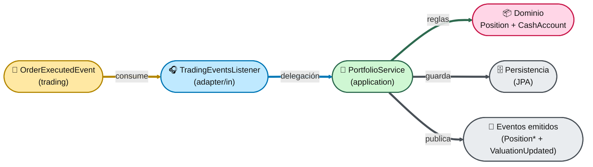
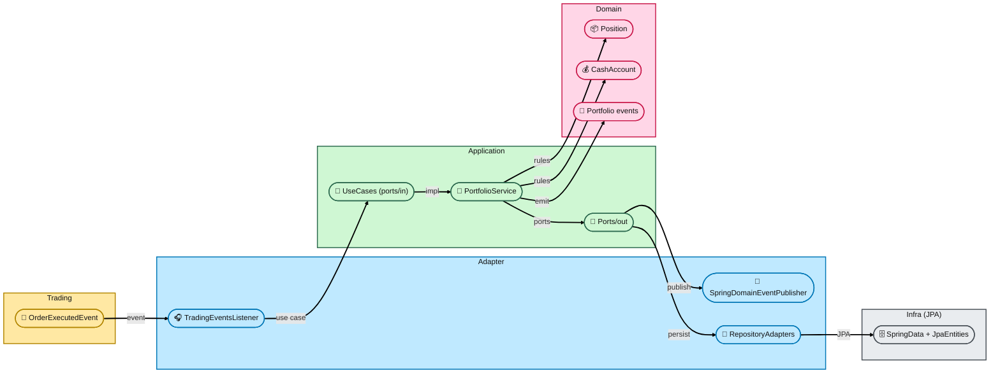
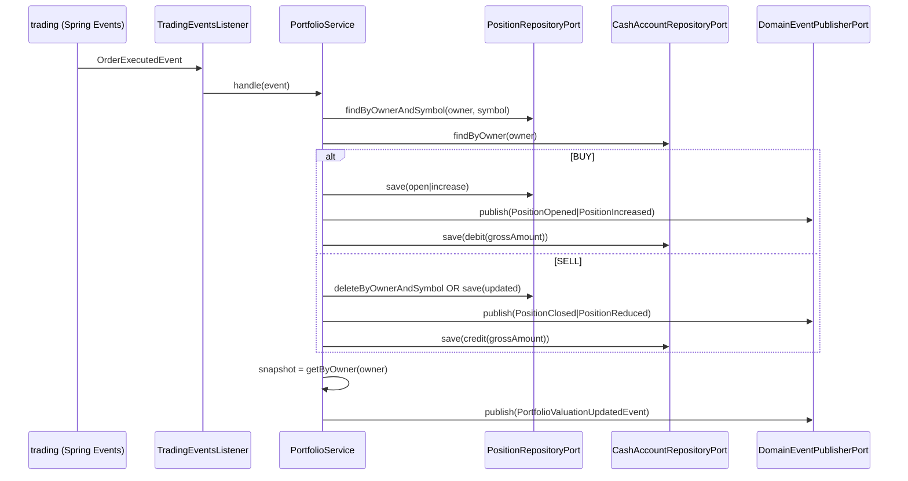

# Módulo `portfolio`

> **Ubicación**: `src/main/java/com/trading/platform/eztrade/portfolio/`

Este módulo modela y mantiene la **cartera** de un usuario:

* **Posiciones** por símbolo (cantidad, coste medio y PnL realizado).
* **Cash disponible**.
* Reacciona a ejecuciones de órdenes emitidas por `trading`.
* Publica eventos cuando cambian posiciones y cuando se recalcula una “valoración” agregada de la cartera.

La descripción oficial del módulo y sus límites están en `portfolio/package-info.java` (líneas **1–20**).

---

## 1) Responsabilidades y límites (qué hace / qué NO hace)

### ✅ Responsabilidades

Según `portfolio/package-info.java` (**4–10**), portfolio:

1. Mantiene posiciones por usuario y símbolo.
2. Mantiene el cash disponible por usuario.
3. Reacciona a eventos de ejecución de órdenes (`trading`).
4. Publica eventos de cambios de posición y de valoración agregada.

### ❌ Fuera de alcance

Según `portfolio/package-info.java` (**12–16**):

* No ejecuta órdenes (pertenece a `trading`).
* No consulta precios de mercado directamente (no hay dependencia directa con `market`).

### Dependencias permitidas (Spring Modulith)

El módulo está declarado como `@ApplicationModule` con:

* `allowedDependencies = {"trading :: events"}`

en `portfolio/package-info.java` (**18–20**). Es decir: **portfolio sólo puede depender del submódulo de eventos de trading**, y el acoplamiento se materializa en el evento `OrderExecutedEvent`.

---

## 2) Arquitectura: Hexagonal (Ports & Adapters)

Este módulo sigue una separación típica:

* **Dominio** (`portfolio/domain`): reglas de negocio puras.
* **Aplicación** (`portfolio/application`): orquestación y casos de uso.
* **Adaptadores** (`portfolio/adapter`): entradas (eventos) y salidas (persistencia + publicación de eventos).

### 2.1. Vista de componentes (alto nivel)



> Si prefieres una vista “arquitectónica” por capas (más detallada), ver **Vista por capas** a continuación.

#### Vista por capas (swimlanes coloreadas)



Referencias:

* Entrada por evento: `adapter/in/events/TradingEventsListener.java` (**20–23**).
* Caso de uso real: `application/services/PortfolioService.java` (**45–69**).
* Puertos de salida: `application/ports/out/*.java`.
* Dominio: `domain/Position.java`, `domain/CashAccount.java`.

---

## 3) Flujo principal: “una orden se ejecuta → portfolio se actualiza”

### 3.1. Entrada: `OrderExecutedEvent` (desde `trading`)

`trading` publica el evento `OrderExecutedEvent` (vía Spring Events). Portfolio lo consume con:

* `TradingEventsListener.on(OrderExecutedEvent event)` en `adapter/in/events/TradingEventsListener.java` (**20–23**), que simplemente delega al caso de uso de aplicación.



La lógica completa está en `application/services/PortfolioService.java`:

* Normalización y validaciones: **48–55**, **157–179**.
* Ruteo por lado BUY/SELL: **55–59**.
* Publicación del evento de valoración agregada: **61–68**.

---

## 4) Reglas de negocio (Dominio)

### 4.1. `Position`: cantidad, coste medio y PnL realizado

Archivo: `domain/Position.java`.

Representa una posición **por** `(owner, symbol)`.

**Atributos principales** (líneas **13–18**):

* `quantity`: unidades actuales.
* `averageCost`: coste medio ponderado.
* `realizedPnl`: PnL realizado acumulado.
* `updatedAt`: marca temporal del último cambio.

**Operaciones de negocio**:

* `open(owner, symbol, quantity, executionPrice)` (**34–38**)
  * Abre una posición nueva.
  * Invariante: cantidad y precio deben ser > 0 (**35–36**).

* `increase(quantityToAdd, executionPrice)` (**49–60**)
  * Recalcula el coste medio ponderando coste actual + coste añadido.
  * Fórmula: `newAverageCost = (currentCost + addedCost) / newQuantity` (**53–58**).

* `reduce(quantityToSell, executionPrice)` (**62–87**)
  * Vende parcialmente o cierra.
  * Invariante: no se puede vender más de lo que hay (**66–68**).
  * Cálculo PnL realizado incremental:
	* `realizedDelta = (executionPrice - averageCost) * quantityToSell` (**70–71**).
  * Si se cierra (cantidad 0) el coste medio se pone a 0 (**73–76**).
  * Devuelve `SellResult(position, realizedPnlDelta)` (**86–87**, **121–122**).

**Consultas auxiliares**:

* `investedAmount()` (**89–91**) = `quantity * averageCost`.
* `isClosed()` (**93–95**) = `quantity == 0`.

### 4.2. `CashAccount`: cash disponible

Archivo: `domain/CashAccount.java`.

* Abre una cuenta inicial en cero: `open(owner)` (**19–21**).
* Suma cash al vender: `credit(amount)` (**27–30**).
* Resta cash al comprar: `debit(amount)` (**32–35**).
* Validación: `amount > 0` (**52–56**).

> Nota: el módulo no impone “no permitir cash negativo”. `debit()` hace `availableCash.subtract(amount)` (**34**) sin comprobar saldo. Si en el futuro se desea evitarlo, la regla debe vivir aquí (dominio), no en el servicio.

### 4.3. Excepciones de dominio

* `domain/PortfolioDomainException.java` (**6–11**): excepción runtime para violaciones de invariantes.

---

## 5) Capa de aplicación: casos de uso y orquestación

### 5.1. Puertos de entrada (Use Cases)

Ubicación: `application/ports/in`.

* `HandleOrderExecutedUseCase` (`handle(OrderExecutedEvent event)`) en `HandleOrderExecutedUseCase.java` (**5–8**).
  * Es el contrato que permite que un adaptador de entrada (listener de eventos) invoca la lógica.

* `GetPortfolioUseCase` (`getByOwner(String owner)`) en `GetPortfolioUseCase.java` (**5–8**).
  * Contrato de lectura (consulta) de la cartera.

### 5.2. Servicio de aplicación: `PortfolioService`

Archivo: `application/services/PortfolioService.java`.

Implementa ambos casos de uso:

* `implements HandleOrderExecutedUseCase, GetPortfolioUseCase` (**31**).

#### Método principal: `handle(OrderExecutedEvent event)`

Se encarga de:

1. Extraer/normalizar datos del evento (`owner`, `symbol`, `quantity`, `price`) (**47–51**, **157–169**).
2. Recuperar o crear la cuenta de cash (**53**).
3. Ejecutar rama BUY o SELL (**55–59**).
4. Recalcular snapshot agregado y publicar `PortfolioValuationUpdatedEvent` (**61–68**).

#### Rama BUY: `handleBuy(...)`

En `PortfolioService.java` (**89–119**):

* Si no existe posición → `Position.open(...)` y publica `PositionOpenedEvent` (**98–107**).
* Si existe → `current.increase(...)` y publica `PositionIncreasedEvent` (**108–116**).
* Debita cash: `cashAccount.debit(grossAmount)` (**118**).

#### Rama SELL: `handleSell(...)`

En `PortfolioService.java` (**121–155**):

* Requiere posición existente o lanza `PortfolioDomainException` (**127–129**).
* Aplica reducción/cierre con `current.reduce(...)` (**130–132**).
* Si queda cerrada → elimina en repositorio y publica `PositionClosedEvent` (**133–141**).
* Si queda abierta → guarda y publica `PositionReducedEvent` (**142–152**).
* Acredita cash: `cashAccount.credit(grossAmount)` (**154**).

#### Lectura agregada: `getByOwner(owner)`

En `PortfolioService.java` (**71–87**):

* Carga todas las posiciones (`findByOwner`) (**74**).
* Suma:
  * `totalCostBasis`: suma de `Position::investedAmount` (**75–77**).
  * `totalRealizedPnl`: suma de `Position::realizedPnl` (**78–80**).
* Lee `cashAvailable` de `CashAccount` (o 0 si no existe) (**82–85**).
* Devuelve `PortfolioSnapshot` (**86**).

---

## 6) Puertos de salida (dependencias externas)

Ubicación: `application/ports/out`.

### 6.1. Persistencia de posiciones: `PositionRepositoryPort`

Archivo: `application/ports/out/PositionRepositoryPort.java` (**8–17**):

* `findByOwnerAndSymbol(owner, symbol)`
* `findByOwner(owner)`
* `save(position)`
* `deleteByOwnerAndSymbol(owner, symbol)`

### 6.2. Persistencia de cash: `CashAccountRepositoryPort`

Archivo: `application/ports/out/CashAccountRepositoryPort.java` (**7–12**):

* `findByOwner(owner)`
* `save(cashAccount)`

### 6.3. Publicación de eventos: `DomainEventPublisherPort`

Archivo: `application/ports/out/DomainEventPublisherPort.java` (**3–6**):

* `publish(Object event)`

Este puerto desacopla la capa de aplicación de la tecnología de eventos (Spring).

---

## 7) Adaptadores

### 7.1. Adaptador de entrada: listener de eventos de trading

* `adapter/in/events/TradingEventsListener.java`
  * Método `on(OrderExecutedEvent event)` (**20–23**) con `@EventListener`.
  * Traduce el evento de `trading` en una llamada al caso de uso `HandleOrderExecutedUseCase`.

### 7.2. Adaptador de salida: publicación de eventos con Spring

* `adapter/out/events/SpringDomainEventPublisher.java` (**7–19**)
  * Implementa `DomainEventPublisherPort`.
  * Usa `ApplicationEventPublisher.publishEvent(event)` (**17–18**).

### 7.3. Adaptadores de salida: persistencia (JPA)

#### Posiciones

* `adapter/out/persistence/PositionRepositoryAdapter.java` (**12–42**)
  * Implementa `PositionRepositoryPort`.
  * Usa `SpringDataPositionRepository`.
  * Mapea dominio ⇄ JPA con `PositionMapper`.

Claves de implementación:

* En `save(...)` se conserva el `id` si ya existe (para hacer update) (**33–36**).

#### Cash

* `adapter/out/persistence/CashAccountRepositoryAdapter.java` (**11–31**)
  * Similar: conserva `id` si existe (**27–30**).

#### Mappers

* `adapter/out/persistence/PositionMapper.java`:
  * `toDomain(...)` rehidrata el agregado con `Position.rehydrate(...)` (**11–19**).
  * `toEntity(...)` copia campos, incluido `updatedAt` (**22–30**).

* `adapter/out/persistence/CashAccountMapper.java`:
  * Rehidratación con `CashAccount.rehydrate(...)` (**11–13**).

#### Entidades JPA

* `adapter/out/persistence/jpa/PositionJpaEntity.java`:
  * Tabla `portfolio_position` y unique `(owner, symbol)` (**14–18**).
  * Campos `quantity`, `averageCost`, `realizedPnl` como `DECIMAL(19, 8)` (**31–38**).

* `adapter/out/persistence/jpa/CashAccountJpaEntity.java`:
  * Tabla `portfolio_cash_account` (**12–13**).
  * Columna `owner` única (**20–21**).

---

## 8) Catálogo de eventos del módulo

### 8.1. Evento consumido (entrada)

* **`OrderExecutedEvent`** (definido en `trading`)
  * Consumido en `TradingEventsListener.on(...)` (**20–23**).
  * Procesado en `PortfolioService.handle(...)` (**45–69**).

### 8.2. Eventos emitidos (salida)

Todos se publican desde `PortfolioService` vía `DomainEventPublisherPort`.

| Evento | Cuándo se emite | Código |
|---|---|---|
| `PositionOpenedEvent` | Compra y no existía posición | `PortfolioService.handleBuy` (**98–107**) |
| `PositionIncreasedEvent` | Compra y ya existía posición | `PortfolioService.handleBuy` (**108–116**) |
| `PositionReducedEvent` | Venta parcial | `PortfolioService.handleSell` (**142–152**) |
| `PositionClosedEvent` | Venta que cierra posición | `PortfolioService.handleSell` (**133–141**) |
| `PortfolioValuationUpdatedEvent` | Tras cada ejecución (BUY/SELL) se recalcula snapshot | `PortfolioService.handle` (**61–68**) |

Definición de records:

* `domain/events/PositionOpenedEvent.java` (**6–12**)
* `domain/events/PositionIncreasedEvent.java` (**6–12**)
* `domain/events/PositionReducedEvent.java` (**6–13**)
* `domain/events/PositionClosedEvent.java` (**6–12**)
* `domain/events/PortfolioValuationUpdatedEvent.java` (**6–12**)

---

## 9) “Mapa mental” rápido: dónde tocar para cada cambio típico

* **Cambiar regla de PnL / coste medio** → `domain/Position.java`.
* **Cambiar reglas de cash (p.ej. no permitir negativo)** → `domain/CashAccount.java`.
* **Cambiar el flujo tras ejecución de orden** → `application/services/PortfolioService.java`.
* **Cambiar persistencia (JPA → otro)** → implementar los puertos en `adapter/out/...`.
* **Cambiar integración con trading (eventos)** → `adapter/in/events/TradingEventsListener.java`.

---

## 10) Inventario de clases (explicación de TODAS las clases del módulo)

> Listado basado en el árbol del paquete `com.trading.platform.eztrade.portfolio`.

### Cómo leer los snippets

Los siguientes fragmentos son **copias literales** (o recortes) del código y están acompañados de:

* **archivo** y **rango de líneas** para poder localizarlo rápidamente,
* una explicación de **por qué existe** y **qué responsabilidad** tiene.

### Root

* `package-info.java`
  * Doc + definición de `@ApplicationModule` (límites y dependencias).
* `portfolio.md`
  * Este documento.

### A) `adapter` (entradas y salidas)

#### A.1. `adapter/in/events`

* `TradingEventsListener`
  * Adaptador de entrada (Spring `@EventListener`) que consume `OrderExecutedEvent` y llama al caso de uso.

**Snippet (el módulo “entra” por aquí)** — `adapter/in/events/TradingEventsListener.java` (**11–23**)

```java
@Component
public class TradingEventsListener {

    private final HandleOrderExecutedUseCase handleOrderExecutedUseCase;

    public TradingEventsListener(HandleOrderExecutedUseCase handleOrderExecutedUseCase) {
        this.handleOrderExecutedUseCase = handleOrderExecutedUseCase;
    }

    @EventListener
    public void on(OrderExecutedEvent event) {
        handleOrderExecutedUseCase.handle(event);
    }
}
```

**Por qué es importante**

* Este listener es el **punto de acoplamiento** permitido con `trading` (vía `trading :: events`).
* Mantiene la integración como “evento → caso de uso” (no hay lógica de negocio aquí).

#### A.2. `adapter/out/events`

* `SpringDomainEventPublisher`
  * Implementación Spring de `DomainEventPublisherPort`.

**Snippet: publicación real en el bus de Spring** — `adapter/out/events/SpringDomainEventPublisher.java` (**7–19**)

```java
@Component
public class SpringDomainEventPublisher implements DomainEventPublisherPort {

    private final ApplicationEventPublisher eventPublisher;

    @Override
    public void publish(Object event) {
        eventPublisher.publishEvent(event);
    }
}
```

Esto permite que `PortfolioService` publique eventos sin depender de Spring directamente.

#### A.3. `adapter/out/persistence` (adaptadores a infraestructura)

* `PositionRepositoryAdapter`
  * Implementación JPA del puerto `PositionRepositoryPort`.
* `CashAccountRepositoryAdapter`
  * Implementación JPA del puerto `CashAccountRepositoryPort`.
* `PositionMapper`
  * Mapeo dominio ⇄ entidad JPA para `Position`.
* `CashAccountMapper`
  * Mapeo dominio ⇄ entidad JPA para `CashAccount`.

##### `PositionRepositoryAdapter` (cómo se guarda realmente una `Position`)

Archivo: `adapter/out/persistence/PositionRepositoryAdapter.java`.

**Snippet: `save` hace upsert preservando el `id`** — (**31–37**)

```java
@Override
public Position save(Position position) {
    Optional<PositionJpaEntity> existing = repository.findByOwnerAndSymbol(position.owner(), position.symbol());
    PositionJpaEntity toSave = PositionMapper.toEntity(position);
    existing.ifPresent(entity -> toSave.setId(entity.getId()));
    return PositionMapper.toDomain(repository.save(toSave));
}
```

**Por qué es importante**: como `Position` (dominio) no tiene `id`, el adaptador usa `(owner, symbol)` para encontrar la fila y reutilizar el `id`.

#### A.4. `adapter/out/persistence/jpa` (modelo de BD)

* `SpringDataPositionRepository`
  * Repositorio Spring Data (consultas por owner/symbol).
* `PositionJpaEntity`
  * Entidad persistida de posición (tabla + constraints).
* `SpringDataCashAccountRepository`
  * Repositorio Spring Data para cash.
* `CashAccountJpaEntity`
  * Entidad persistida de cuenta de cash.

##### `PositionJpaEntity` (schema y constraint)

Archivo: `adapter/out/persistence/jpa/PositionJpaEntity.java`.

**Snippet: tabla y unique constraint** — (**14–18**)

```java
@Entity
@Table(
        name = "portfolio_position",
        uniqueConstraints = @UniqueConstraint(
                name = "uk_portfolio_position_owner_symbol",
                columnNames = {"owner", "symbol"}
        )
)
public class PositionJpaEntity {
    // ...
}
```

Este constraint es el que garantiza que haya **como máximo una posición por (owner, symbol)**.

### B) `application` (casos de uso + orquestación)

#### B.1. `application/ports/in` (contratos de entrada)

* `GetPortfolioUseCase`
  * Contrato de consulta de cartera.
* `HandleOrderExecutedUseCase`
  * Contrato para procesar ejecuciones de órdenes.

**Nota**: estos puertos permiten que la capa de entrada (web, eventos, etc.) dependa **solo** de interfaces.

#### B.2. `application/ports/out` (contratos hacia infraestructura)

* `PositionRepositoryPort`
  * Abstracción de persistencia/consulta de posiciones.
* `CashAccountRepositoryPort`
  * Abstracción de persistencia/consulta del cash.
* `DomainEventPublisherPort`
  * Publicación de eventos del módulo (desacopla de Spring).

#### B.3. `application/services`

* `PortfolioService`
  * Orquestador del módulo: aplica BUY/SELL, persiste y publica eventos.

##### `PortfolioService` (la clase central del módulo)

Archivo: `application/services/PortfolioService.java`.

Es la clase más relevante porque:

* implementa los **casos de uso** del módulo,
* coordina **dominio + persistencia + publicación de eventos**,
* encapsula el “happy path” BUY/SELL.

**Snippet 1: firma, puertos y método `handle`** — `PortfolioService.java` (**29–69**)

```java
@Service
@Transactional
public class PortfolioService implements HandleOrderExecutedUseCase, GetPortfolioUseCase {

    private final PositionRepositoryPort positionRepository;
    private final CashAccountRepositoryPort cashAccountRepository;
    private final DomainEventPublisherPort eventPublisher;

    @Override
    public void handle(OrderExecutedEvent event) {
        String owner = event.owner();
        String symbol = normalizeSymbol(event.symbol());
        BigDecimal quantity = positive(event.quantity(), "Quantity");
        BigDecimal price = positive(event.price(), "Price");
        BigDecimal grossAmount = quantity.multiply(price);

        CashAccount cashAccount = cashAccountRepository.findByOwner(owner)
                .orElseGet(() -> CashAccount.open(owner));

        Side side = parseSide(event.side());
        switch (side) {
            case BUY -> handleBuy(owner, symbol, quantity, price, grossAmount, cashAccount);
            case SELL -> handleSell(owner, symbol, quantity, price, grossAmount, cashAccount);
        }

        PortfolioSnapshot snapshot = getByOwner(owner);
        eventPublisher.publish(new PortfolioValuationUpdatedEvent(
                owner,
                snapshot.cashAvailable(),
                snapshot.totalCostBasis(),
                snapshot.totalRealizedPnl(),
                LocalDateTime.now()
        ));
    }
}
```

**Qué decisiones de diseño se ven aquí**

* **Validaciones “de entrada”** (symbol/quantity/price/side) antes de tocar el dominio.
* **Cuenta cash lazy**: si no existe, se abre con `CashAccount.open(owner)`.
* Tras cada ejecución se publica siempre `PortfolioValuationUpdatedEvent` (evento agregado).

**Snippet 2: BUY crea o incrementa y debita cash** — `PortfolioService.java` (**89–119**)

```java
private void handleBuy(String owner,
                       String symbol,
                       BigDecimal quantity,
                       BigDecimal price,
                       BigDecimal grossAmount,
                       CashAccount cashAccount) {
    Position current = positionRepository.findByOwnerAndSymbol(owner, symbol).orElse(null);
    Position saved;

    if (current == null) {
        saved = positionRepository.save(Position.open(owner, symbol, quantity, price));
        eventPublisher.publish(new PositionOpenedEvent(owner, symbol, saved.quantity(), saved.averageCost(), LocalDateTime.now()));
    } else {
        saved = positionRepository.save(current.increase(quantity, price));
        eventPublisher.publish(new PositionIncreasedEvent(owner, symbol, saved.quantity(), saved.averageCost(), LocalDateTime.now()));
    }

    cashAccountRepository.save(cashAccount.debit(grossAmount));
}
```

**Snippet 3: SELL reduce/cierra y acredita cash** — `PortfolioService.java` (**121–155**)

```java
private void handleSell(String owner,
                        String symbol,
                        BigDecimal quantity,
                        BigDecimal price,
                        BigDecimal grossAmount,
                        CashAccount cashAccount) {
    Position current = positionRepository.findByOwnerAndSymbol(owner, symbol)
            .orElseThrow(() -> new PortfolioDomainException("Position not found for symbol: " + symbol));

    Position.SellResult result = current.reduce(quantity, price);
    Position updated = result.position();

    if (updated.isClosed()) {
        positionRepository.deleteByOwnerAndSymbol(owner, symbol);
        eventPublisher.publish(new PositionClosedEvent(owner, symbol, result.realizedPnlDelta(), updated.realizedPnl(), LocalDateTime.now()));
    } else {
        positionRepository.save(updated);
        eventPublisher.publish(new PositionReducedEvent(owner, symbol, updated.quantity(), result.realizedPnlDelta(), updated.realizedPnl(), LocalDateTime.now()));
    }

    cashAccountRepository.save(cashAccount.credit(grossAmount));
}
```

**Detalle clave**: en SELL la lógica de PnL está en el dominio (`Position.reduce`) y el servicio solo decide si borrar o actualizar.

### C) `domain` (modelo de negocio)

* `Position`
  * Agregado: quantity/averageCost/realizedPnl + reglas de open/increase/reduce.
* `CashAccount`
  * Entidad: cash disponible + reglas credit/debit.
* `PortfolioSnapshot`
  * Vista agregada retornada por el caso de uso de lectura.
* `PortfolioDomainException`
  * Excepción de dominio.

#### `Position` (regla crítica: cálculo de PnL realizado)

Archivo: `domain/Position.java`.

**Snippet: `reduce(...)` calcula el PnL incremental y ajusta estado** — (**62–87**)

```java
public SellResult reduce(BigDecimal quantityToSell, BigDecimal executionPrice) {
    requirePositive(quantityToSell, "Quantity to sell");
    requirePositive(executionPrice, "Execution price");

    if (quantityToSell.compareTo(quantity) > 0) {
        throw new PortfolioDomainException("Cannot sell more units than current position");
    }

    BigDecimal realizedDelta = executionPrice.subtract(averageCost).multiply(quantityToSell);
    BigDecimal newRealizedPnl = realizedPnl.add(realizedDelta);
    BigDecimal remainingQuantity = quantity.subtract(quantityToSell);
    BigDecimal newAverageCost = remainingQuantity.compareTo(BigDecimal.ZERO) == 0
            ? BigDecimal.ZERO
            : averageCost;

    Position updated = new Position(owner, symbol, remainingQuantity, newAverageCost, newRealizedPnl, LocalDateTime.now());
    return new SellResult(updated, realizedDelta);
}
```

**Interpretación**

* `realizedDelta` es el PnL de **esa venta**.
* `realizedPnl` acumula el PnL realizado histórico de la posición.
* No existe PnL no realizado (unrealized) porque el módulo no consulta precios de mercado.

#### `CashAccount` (operaciones credit/debit)

Archivo: `domain/CashAccount.java`.

**Snippet: `credit` / `debit`** — (**27–35**)

```java
public CashAccount credit(BigDecimal amount) {
    validateAmount(amount);
    return new CashAccount(owner, availableCash.add(amount));
}

public CashAccount debit(BigDecimal amount) {
    validateAmount(amount);
    return new CashAccount(owner, availableCash.subtract(amount));
}
```

Esto refuerza la idea de “dominio inmutable”: cada operación devuelve un nuevo objeto.

#### C.1. `domain/events` (eventos de dominio del módulo)

* `PositionOpenedEvent`
* `PositionIncreasedEvent`
* `PositionReducedEvent`
* `PositionClosedEvent`
* `PortfolioValuationUpdatedEvent`

##### Eventos como `record` (mensajes simples)

Ejemplo — `domain/events/PositionReducedEvent.java` (**6–13**)

```java
public record PositionReducedEvent(
        String owner,
        String symbol,
        BigDecimal quantity,
        BigDecimal realizedPnlDelta,
        BigDecimal totalRealizedPnl,
        LocalDateTime occurredAt
) {
}
```

**Por qué es útil**: el evento expone tanto el cambio puntual (`realizedPnlDelta`) como el acumulado (`totalRealizedPnl`), facilitando proyecciones/lecturas en otros módulos.

---

## 11) Notas de diseño y mejoras futuras (opcional)

* Hoy `PortfolioValuationUpdatedEvent` es una agregación sin precios de mercado (solo cash + coste + PnL realizado). Para “valor de mercado” sería necesario integrar precios (idealmente vía un puerto hacia `market`).
* La regla de “cash no negativo” no existe actualmente (ver `CashAccount.debit`), por lo que el módulo permite saldos negativos. Si interesa, conviene introducir:
  * `CashAccount.debit(...)` con validación, o
  * un concepto de “margen” si se permite apalancamiento.

