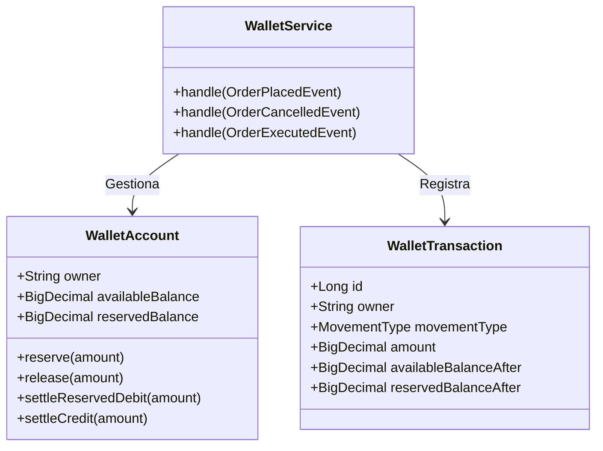
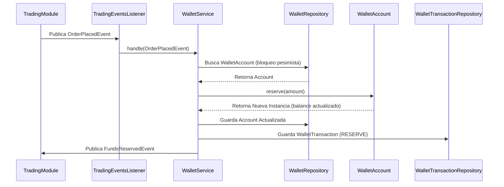

# Módulo Wallet

## Visión General
El módulo **Wallet** es el responsable de gestionar la contabilidad de efectivo de los usuarios en la plataforma EZTrade. Su principal objetivo es asegurar la **integridad de los saldos** (disponible y reservado) y mantener un **registro de auditoría** (ledger) inmutable de todas las transacciones.

## Funcionalidades Principales
1. **Gestión de Saldos**: Controla dos tipos de saldo por usuario:
   - **Disponible (`availableBalance`)**: Fondos libres para retirar o usar en nuevas órdenes.
   - **Reservado (`reservedBalance`)**: Fondos retenidos temporalmente para órdenes de compra (BUY) activas.
2. **Reacción a Eventos de Trading**:
   - **Reserva de Fondos**: Al recibir una orden `BUY` (`OrderPlacedEvent`), reserva el importe necesario.
   - **Liberación de Fondos**: Si una orden se cancela (`OrderCancelledEvent`), libera los fondos reservados.
   - **Liquidación (Settlement)**: Al ejecutarse una orden (`OrderExecutedEvent`), consume el saldo reservado (compra) o abona al disponible (venta).
3. **Ajustes Manuales**: Permite depósitos y retiros manuales (administración o integración con pasarelas de pago).
4. **Auditoría**: Cada movimiento genera una `WalletTransaction` que actúa como libro mayor (Ledger).

## Arquitectura y Componentes
Este módulo sigue una arquitectura hexagonal (Ports & Adapters).

### Diagrama de Clases (Dominio Simplificado)


## Explicación de Clases y Código

### 1. Capa de Dominio (`domain`)
Es el núcleo de la lógica de negocio, libre de dependencias de framework. Aquí se definen las reglas de cómo se mueve el dinero.

#### 1.1 `WalletAccount` (Entidad Raíz)
Representa la cuenta de efectivo de un usuario. Diseñada como una clase **inmutable** para garantizar consistencia: cualquier modificación genera una **nueva instancia** con los balances actualizados.

* **Responsabilidad**: Validar que hay fondos suficientes y calcular los nuevos balances.
* **Ubicación**: `src/main/java/com/trading/platform/eztrade/wallet/domain/WalletAccount.java`

```java
public class WalletAccount {
    private final String owner;
    private final BigDecimal availableBalance; // Saldo disponible para usar
    private final BigDecimal reservedBalance;  // Saldo retenido en órdenes activas

    // Ejemplo: Reservar fondos para una orden de compra (BUY)
    // Reduce disponible, aumenta reservado.
    public WalletAccount reserve(BigDecimal amount) {
        validateAmount(amount);
        ensureSufficientAvailable(amount);
        // Retorna NUEVA instancia (Inmutabilidad)
        return new WalletAccount(owner, 
                                 availableBalance.subtract(amount), 
                                 reservedBalance.add(amount));
    }
    
    // ... otros métodos: deposit, release, settleReservedDebit, etc.
}
```

#### 1.2 `WalletTransaction` (Ledger)
Es el **Libro Mayor**. Cada vez que el estado de una `WalletAccount` cambia, se debe guardar un registro inmutable aquí. Se implementa como un `record` de Java.

* **Responsabilidad**: Auditoría y trazabilidad histórica.
* **Ubicación**: `src/main/java/com/trading/platform/eztrade/wallet/domain/WalletTransaction.java`

```java
public record WalletTransaction(
    Long id,
    String owner,
    MovementType movementType,       // Tipo de operación (ej. RESERVE)
    BigDecimal amount,               // Importe base
    BigDecimal availableDelta,       // Cambio en disponible (ej. -100)
    BigDecimal reservedDelta,        // Cambio en reservado (ej. +100)
    BigDecimal availableBalanceAfter,// Balance final tras operación
    BigDecimal reservedBalanceAfter,
    ReferenceType referenceType,     // Origen (ORDER, MANUAL)
    String referenceId,              // ID de la orden o referencia externa
    LocalDateTime occurredAt
) {}
```

#### 1.3 Enumerados (`MovementType` y `ReferenceType`)
Definen la semántica de las operaciones para evitar "números mágicos" o strings.

* **`MovementType`**:
  ```java
  public enum MovementType {
      DEPOSIT,           // Ingreso
      WITHDRAWAL,        // Retirada
      RESERVE,           // Bloqueo de fondos (inicio orden BUY)
      RELEASE,           // Desbloqueo (cancelación orden)
      SETTLEMENT_DEBIT,  // Compra ejecutada (gasta reservado)
      SETTLEMENT_CREDIT, // Venta ejecutada (ingresa disponible)
      FEE                // Comisión
  }
  ```

### 2. Capa de Aplicación (`application`)
Orquesta los flujos de negocio, gestiona transacciones de base de datos y conecta los puertos.

#### 2.1 `WalletService`
Es el corazón transaccional. Coordina la carga de la entidad, la ejecución de la lógica y la persistencia del ledger.

* **Responsabilidad**: Garantizar la atomicidad (Cuenta + Ledger) e idempotencia.
* **Ubicación**: `src/main/java/com/trading/platform/eztrade/wallet/application/services/WalletService.java`

**Ejemplo: Manejo de `OrderPlacedEvent` (Reserva de fondos)**
```java
@Service
@Transactional
public class WalletService implements HandleOrderPlacedUseCase, ... {

    @Override
    public void handle(OrderPlacedEvent event) {
        // Solo las BUY requieren reservar dinero
        if (!"BUY".equalsIgnoreCase(event.side())) return;

        // 1. Idempotencia: ¿Ya procesamos esta orden?
        if (ledgerEntryRepository.existsByOwnerAndReferenceIdAndMovementType(
                owner, orderId, MovementType.RESERVE)) {
            return;
        }

        // 2. Bloqueo pesimista para evitar condiciones de carrera
        WalletAccount account = lockOrOpenAccount(owner);

        // 3. Ejecutar lógica de dominio
        // (Llama al método reserve() visto en WalletAccount)
        WalletAccount updated = account.reserve(amount);
        walletAccountRepository.save(updated);

        // 4. Registrar en Ledger (Auditoría)
        ledgerEntryRepository.save(WalletTransaction.newEntry(
                owner,
                MovementType.RESERVE,
                amount,
                amount.negate(), // availableDelta
                amount,          // reservedDelta
                updated.availableBalance(),
                updated.reservedBalance(),
                ReferenceType.ORDER,
                orderRef,
                "Funds reserved for order",
                now()
        ));

        // 5. Publicar evento de dominio (Integración)
        eventPublisher.publish(new FundsReservedEvent(...));
    }
}
```

### 3. Capa de Adaptadores (`adapter`)
La "entrada" al hexágono. Recibe estímulos externos y llama a la capa de aplicación.

#### 3.1 `TradingEventsListener`
Escucha eventos asíncronos del módulo de Trading (Orders) usando el bus de eventos de Spring.

* **Responsabilidad**: Desacoplar el mecanismo de entrega (Spring Events) de la lógica de negocio.
* **Ubicación**: `src/main/java/com/trading/platform/eztrade/wallet/adapter/in/events/TradingEventsListener.java`

```java
@Component
public class TradingEventsListener {

    private final HandleOrderPlacedUseCase handleOrderPlacedUseCase;
    // ... otros casos de uso inyectados ...

    @EventListener
    public void on(OrderPlacedEvent event) {
        // Delega inmediatamente en la capa de aplicación
        handleOrderPlacedUseCase.handle(event);
    }

    @EventListener
    public void on(OrderCancelledEvent event) {
        handleOrderCancelledUseCase.handle(event);
    }
    
    // ...
}
```

## Flujo de Ejecución: Reserva de Fondos (Ejemplo)
Cuando el usuario coloca una orden de compra, el flujo es el siguiente:



Esta estructura garantiza que el dinero nunca se pierda ni se duplique, manteniendo una traza perfecta de cada céntimo movido.

