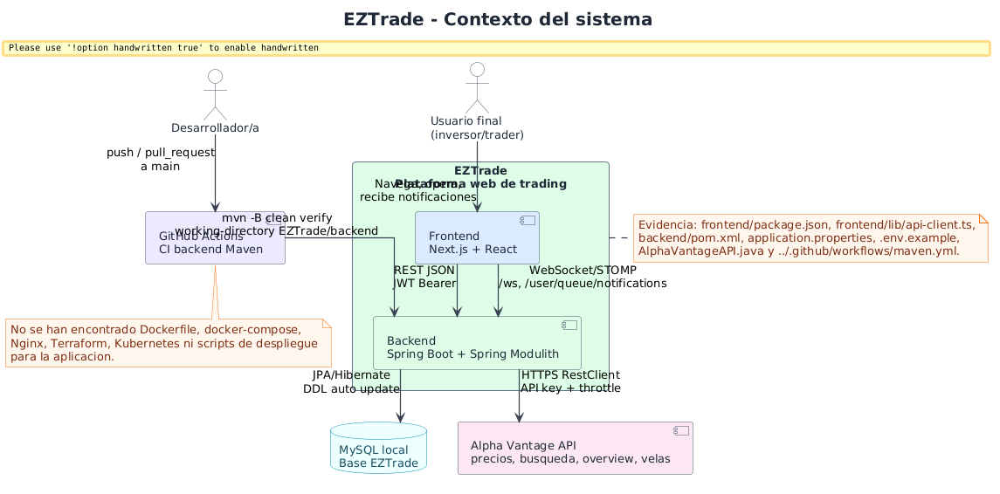
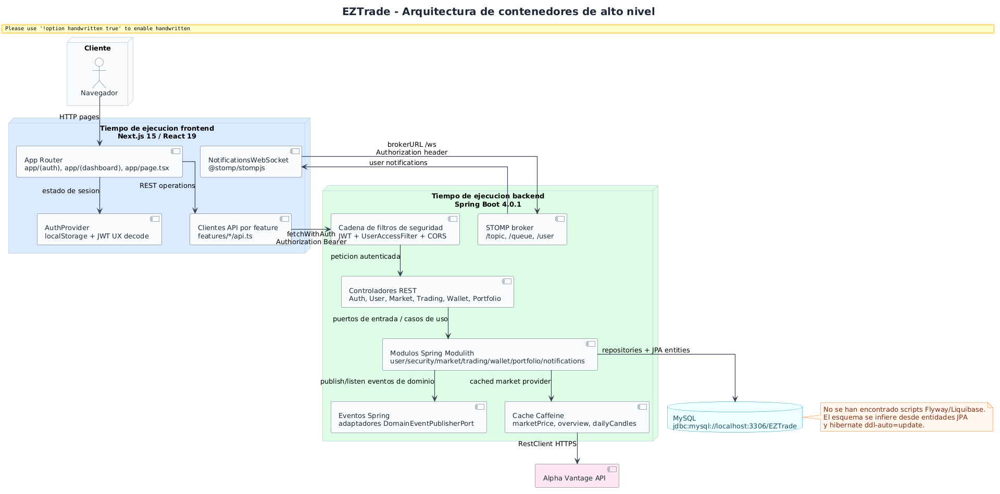
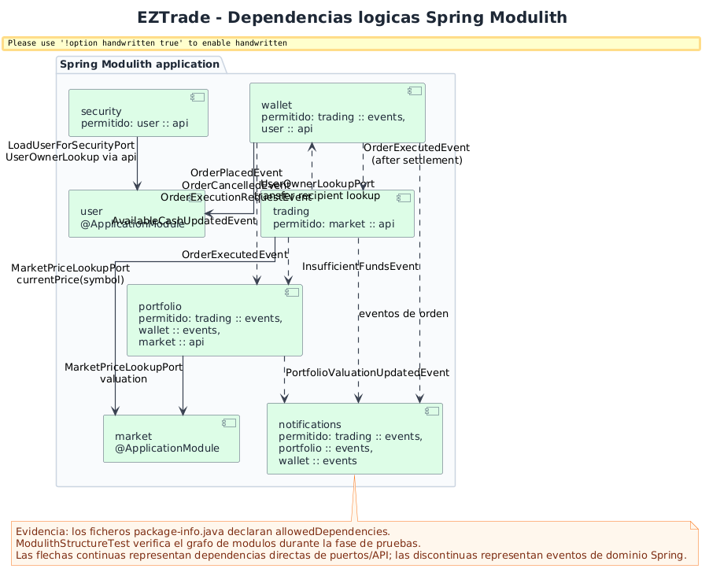
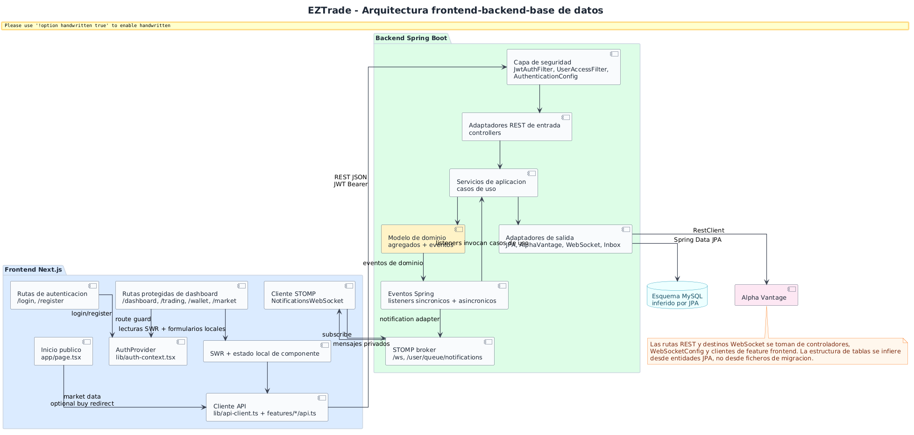

# Diagramas de arquitectura

Esta seccion ofrece la vision estructural de EZTrade: frontera del sistema, contenedores logicos, modulos Spring Modulith y relacion frontend-backend-base de datos. Los diagramas se han obtenido cruzando `frontend/package.json`, `frontend/lib/api-client.ts`, `backend/pom.xml`, `backend/src/main/resources/application.properties`, los controladores REST, `WebSocketConfig`, `AlphaVantageAPI` y `../.github/workflows/maven.yml`.

## Contexto del sistema

**Proposito.** Situa EZTrade frente a sus usuarios, la API externa de Alpha Vantage, MySQL local y la automatizacion CI.

**Como leerlo.** El rectangulo central es el sistema propio. Las flechas muestran interacciones confirmadas: REST y STOMP desde el navegador, JDBC hacia MySQL, HTTPS hacia Alpha Vantage y Maven verify desde GitHub Actions.

**Valor.** Es el diagrama mas util para abrir una memoria tecnica porque define frontera, actores y dependencias externas sin entrar todavia en detalles internos.

**Limitacion.** No se muestra infraestructura de produccion porque no hay manifests, IaC, reverse proxy ni scripts de despliegue en el repositorio.

## Arquitectura de contenedores de alto nivel

**Proposito.** Descompone el sistema en tiempo de ejecucion frontend, tiempo de ejecucion backend, base de datos e integracion externa.

**Como leerlo.** Next.js concentra rutas, contexto de autenticacion, clientes API y STOMP. Spring Boot concentra seguridad, controladores, modulos, eventos, cache y broker STOMP. MySQL y Alpha Vantage quedan fuera del backend como dependencias de infraestructura.

**Valor.** Aporta una vision de contenedores clara para explicar despliegue local, contratos HTTP, WebSocket y persistencia.

**Limitacion.** La topologia es logica/inferida por configuracion, no una topologia Docker Compose.

## Dependencias logicas entre modulos

**Proposito.** Representa los modulos Spring Modulith y sus dependencias permitidas.

**Como leerlo.** Las flechas continuas son dependencias directas por puertos/API publicas; las discontinuas son eventos de dominio publicados y consumidos mediante Eventos Spring.

**Valor.** Justifica la modularidad: `trading` no depende directamente de `wallet` o `portfolio`, sino que coordina mediante eventos; `security` solo cruza hacia `user :: api`.

**Evidencia.** `package-info.java` de cada modulo y `ModulithStructureTest`.

## Arquitectura frontend-backend-base de datos

**Proposito.** Une la perspectiva de UI, API, seguridad, aplicacion, dominio, persistencia y notificaciones.

**Como leerlo.** La lectura principal va de paginas Next.js a clientes API, despues a filtros de seguridad, controladores, servicios, dominio y adaptadores. El flujo de notificaciones vuelve por STOMP hacia el cliente.

**Valor.** Es el puente entre arquitectura de software y tiempo de ejecucion operativo, especialmente relevante para explicar mantenibilidad y trazabilidad tecnica.

**Limitacion.** La estructura de tablas se infiere desde JPA; no hay DDL versionado.

## Conclusion

En conjunto, estos diagramas muestran que EZTrade es una aplicacion full stack modular: frontend Next.js, backend Spring Boot/Spring Modulith, persistencia relacional y eventos internos para desacoplar operaciones financieras, portfolio y notificaciones. La documentacion tambien deja visible que la infraestructura productiva no esta declarada todavia.
