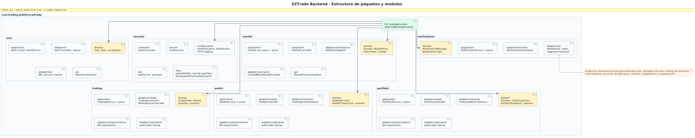
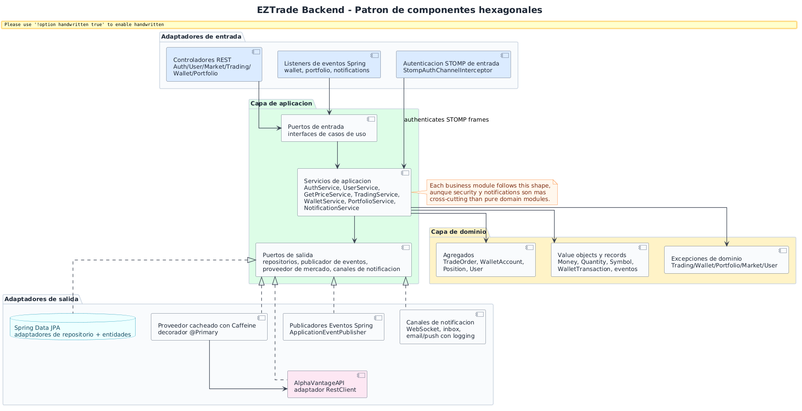
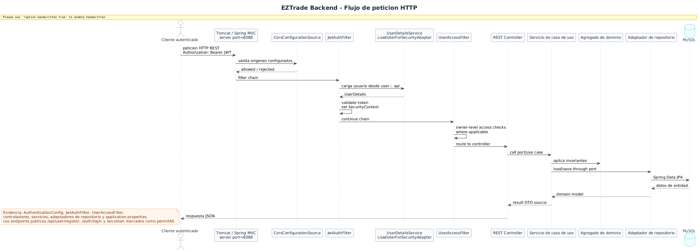
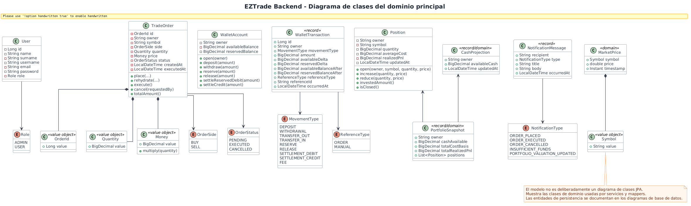
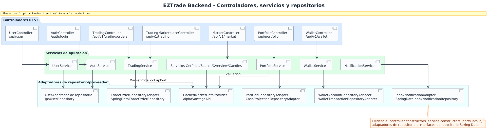
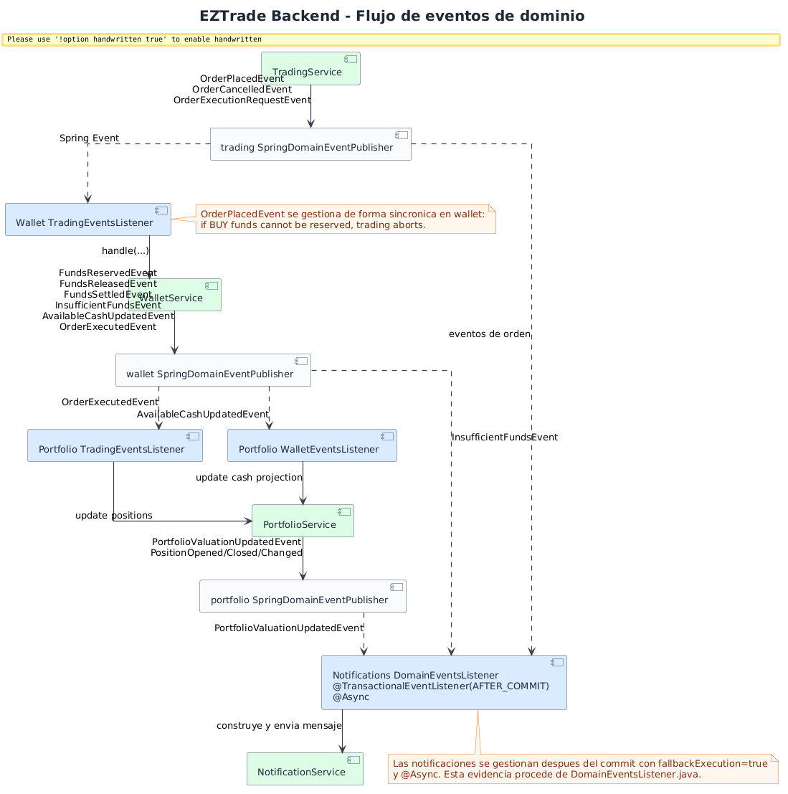

# Diagramas backend

La familia backend documenta la arquitectura Spring Boot desde varios niveles: paquetes, patron hexagonal, flujo de peticion, clases de dominio, mapa controller-service-repository y eventos intermodulo. La evidencia principal esta en `backend/src/main/java/com/trading/platform/eztrade`, `backend/pom.xml`, `application.properties` y `backend/src/test/java`.

## Estructura de paquetes backend

**Proposito.** Mostrar la organizacion real de paquetes y capas por modulo.

**Como leerlo.** Cada paquete principal (`user`, `security`, `market`, `trading`, `wallet`, `portfolio`, `notifications`) aparece con dominio, aplicacion y adaptadores cuando existen.

**Valor.** Permite defender la separacion por bounded contexts y localizar rapidamente responsabilidades tecnicas.

## Componentes hexagonales backend

**Proposito.** Explicar el patron de puertos y adaptadores aplicado en los modulos.

**Como leerlo.** Las entradas REST/eventos invocan puertos de entrada; los servicios orquestan dominio y puertos de salida; los adaptadores implementan persistencia, eventos, Alpha Vantage y canales de notificacion.

**Valor.** Conecta el codigo con arquitectura hexagonal de forma academica y verificable.

## Flujo de peticion HTTP backend

**Proposito.** Describir el recorrido de una peticion HTTP autenticada por el backend.

**Como leerlo.** El flujo atraviesa CORS, `JwtAuthFilter`, carga de usuario, `UserAccessFilter`, controlador, caso de uso, dominio y repositorio JPA.

**Valor.** Hace visible la seguridad operacional de las APIs y donde se aplican autenticacion, autorizacion y reglas de negocio.

## Diagrama de clases de dominio

**Proposito.** Sintetizar agregados, value objects, enums y records de dominio.

**Como leerlo.** `TradeOrder`, `WalletAccount`, `Position` y `User` son los elementos centrales. `WalletTransaction` representa el ledger auditable y `PortfolioSnapshot` la vista agregada de cartera.

**Valor.** Sirve para explicar invariantes, ciclo de vida de ordenes, balances, posiciones y notificaciones sin mezclar detalles JPA.

**Limitacion.** No pretende ser el modelo fisico de datos; ese detalle esta en los diagramas de base de datos.

## Mapa de servicios, controladores y repositorios

**Proposito.** Relacionar endpoints, servicios de aplicacion y adaptadores de persistencia/proveedor.

**Como leerlo.** Las flechas desde controladores indican delegacion a servicios; las flechas desde servicios indican puertos/adaptadores usados.

**Valor.** Es una guia de mantenimiento: ayuda a saber que clases se tocan al cambiar una funcionalidad.

## Flujo de eventos backend

**Proposito.** Mostrar la comunicacion por eventos entre `trading`, `wallet`, `portfolio` y `notifications`.

**Como leerlo.** `wallet` escucha algunos eventos de trading de forma sincrona para poder abortar si no hay fondos. `notifications` usa listeners despues de commit y asincronos.

**Valor.** Explica desacoplamiento, consistencia transaccional y consistencia eventual dentro del monolito modular.

## Conclusion

El backend no es un CRUD plano: combina Spring Modulith, arquitectura hexagonal, dominio rico, eventos y adaptadores. Esta estructura favorece mantenibilidad, pruebas por modulo y evolucion independiente de los contextos de negocio.
