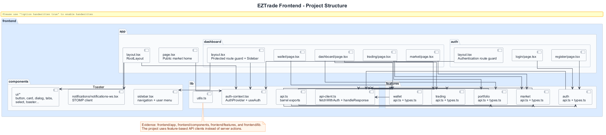
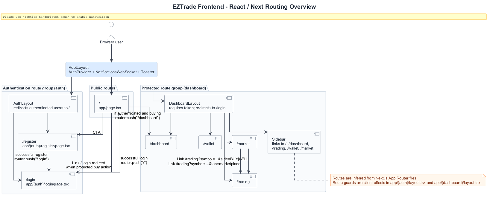
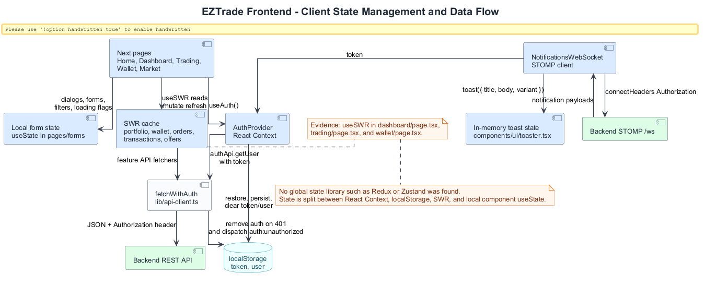
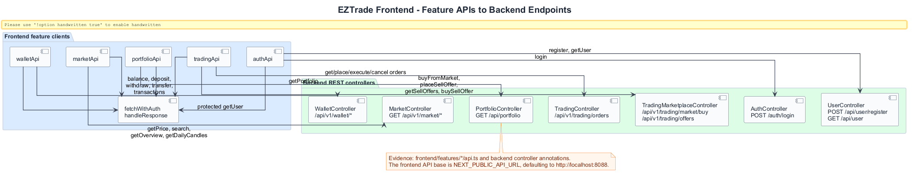

# Frontend Diagrams

These diagrams document the Next.js/React frontend based on `frontend/app`, `frontend/components`, `frontend/features`, and `frontend/lib`. The focus is structure, routes, state, and contracts toward the backend.

## Frontend Structure

**Purpose.** Show how the frontend project is organized by App Router, reusable components, features, and shared libraries.

**How to read it.** `app/` defines screens and layouts; `features/` encapsulates API clients and types; `lib/` concentrates authentication and HTTP client; `components/` provides navigation, UI, and WebSocket.

**Value.** Explains a maintainable React structure without mixing views, HTTP contracts, and utilities.

## React Routing Overview

**Purpose.** Represent public routes, authentication routes, and protected routes.

**How to read it.** `(auth)` redirects already authenticated users; `(dashboard)` blocks access without a token. `Sidebar` articulates main navigation, and `MarketPage` links to `TradingPage` through query params.

**Value.** Helps justify user experience, screen protection, and functional navigation.

## Frontend State Management

**Purpose.** Show how client state is managed without Redux/Zustand.

**How to read it.** `AuthProvider` maintains session and `localStorage`; SWR caches reads for portfolio, wallet, and orders; forms and dialogs use `useState`; STOMP feeds toasts.

**Value.** Explains real state decisions and their impact on UX, cache, and session restoration.

## Frontend-Backend Interaction

**Purpose.** Map frontend API clients to backend controllers.

**How to read it.** Each `features/*/api.ts` points to concrete endpoints: auth/user, market, trading, wallet, and portfolio. `fetchWithAuth` centralizes the JWT header and 401 handling.

**Value.** Gives traceability between UI, HTTP contracts, and backend REST adapters, useful for evolving endpoints without losing impact visibility.

## Conclusion

The frontend uses a pragmatically modular architecture: App Router routes, domain-based features, minimal global state, and explicit API clients. WebSocket communication is limited to private notifications, matching the backend STOMP design.
