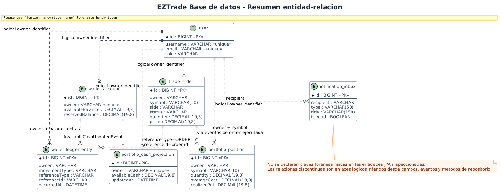
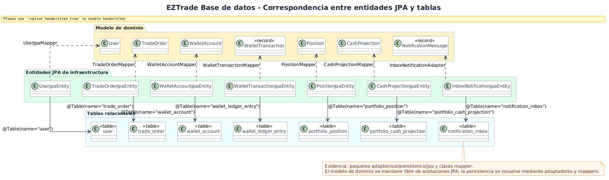
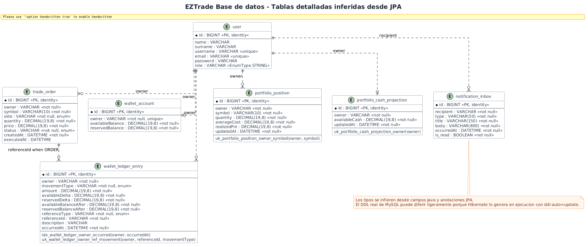

# Diagramas de base de datos

La base de datos se documenta desde entidades JPA y repositorios Spring Data. No se han encontrado migraciones Flyway/Liquibase ni DDL versionado, por lo que los diagramas describen el esquema inferido por JPA/Hibernate y `spring.jpa.hibernate.ddl-auto=update`.

## Resumen entidad-relacion

**Proposito.** Resumir tablas, claves y relaciones logicas principales.

**Como leerlo.** Las relaciones discontinuas no son FKs declaradas: representan conexiones logicas por `owner`, `recipient`, `symbol` y `referenceId`.

**Valor.** Explica la persistencia del dominio sin inventar constraints fisicas.

**Limitacion.** El repositorio no declara asociaciones JPA entre entidades ni claves foraneas explicitas.

## Correspondencia entidades JPA-tablas

**Proposito.** Relacionar dominio, entidades JPA y tablas.

**Como leerlo.** Los mappers convierten entre modelos de dominio y entidades de infraestructura. Cada entidad JPA termina en una tabla concreta.

**Valor.** Hace visible la separacion dominio-persistencia, importante para explicar arquitectura hexagonal y testabilidad.

## Detalle de tablas de base de datos

**Proposito.** Detallar columnas, tipos inferidos, indices y restricciones unicas.

**Como leerlo.** Cada tabla muestra PK, campos relevantes, `DECIMAL(19,8)` para importes/cantidades y constraints declarados con `@Table`, `@Column`, `@Index` y `@UniqueConstraint`.

**Valor.** Sirve como referencia tecnica para memoria, auditoria y futuras migraciones.

**Limitacion.** El DDL real puede variar ligeramente segun dialecto MySQL y evolucion previa de una base con `ddl-auto=update`.

## Conclusion

El modelo relacional esta orientado a persistir agregados y proyecciones por modulo. La ausencia de migraciones y FKs explicitas es un punto importante de mejora operativa: facilita el desarrollo local, pero reduce trazabilidad y control del esquema en entornos compartidos.
