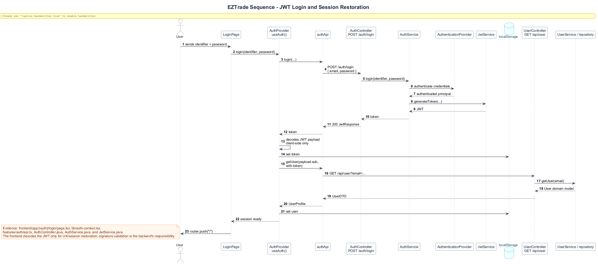
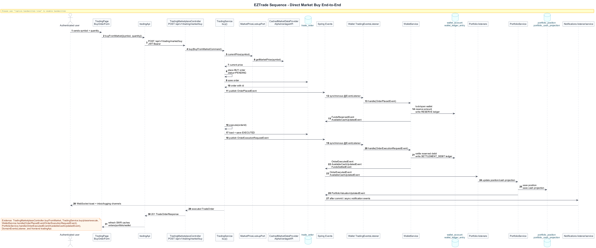
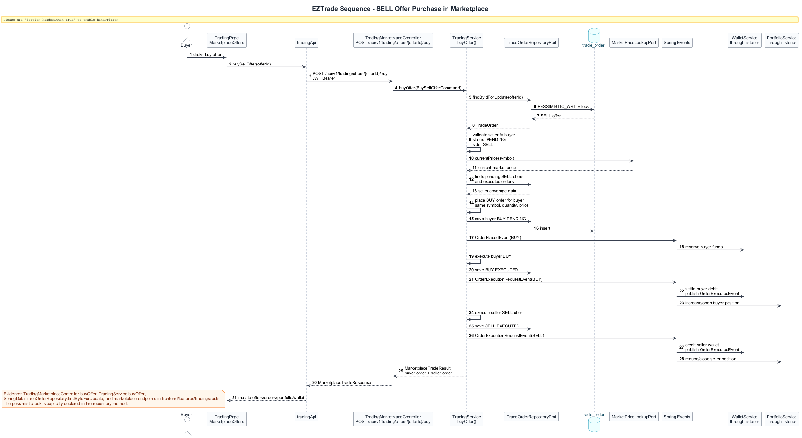
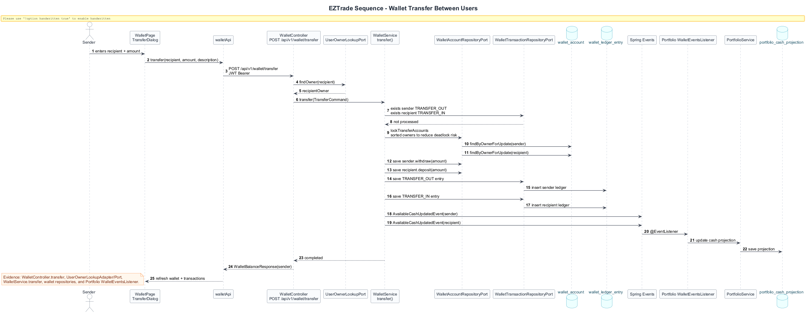
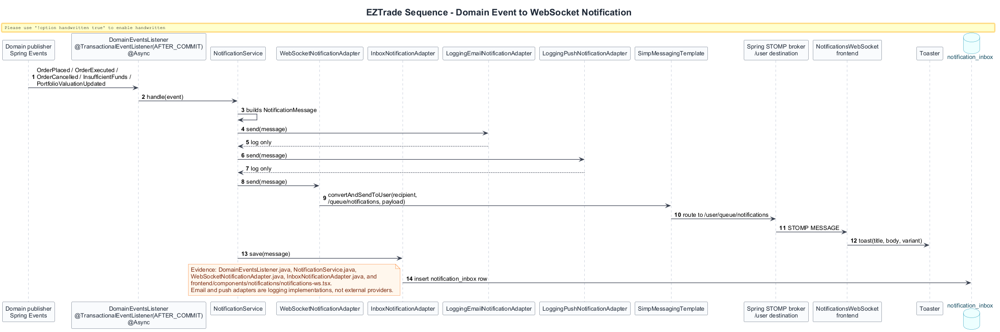

# Sequence Diagrams

The sequences capture end-to-end operations that cross frontend, controllers, services, events, persistence, and notifications. They were derived from API clients in `frontend/features`, REST controllers, application services, event listeners, and output adapters.

## JWT Login Sequence

**Purpose.** Show JWT login and user-data restoration.

**How to read it.** The frontend obtains a JWT, stores it, decodes the payload only for UX, and loads the complete user through `/api/user`.

**Value.** Explains authentication, local session persistence, and separation between backend validation and frontend experience.

## Direct Market Buy Sequence

**Purpose.** Model the direct market buy.

**How to read it.** Trading queries price, creates a BUY order, wallet reserves and settles funds, portfolio updates position/cash, and notifications informs the user.

**Value.** This is the most complete critical case for explaining module collaboration and events.

## Marketplace Offer Purchase Sequence

**Purpose.** Represent the purchase of a SELL offer between users.

**How to read it.** The service locks the offer with `findByIdForUpdate`, validates status/price/coverage, creates the buyer BUY, and executes BUY + SELL to propagate effects to wallet and portfolio.

**Value.** Documents concurrency, consistency, and marketplace rules.

## Wallet Transfer Sequence

**Purpose.** Show cash transfer between users.

**How to read it.** The controller resolves the recipient, `WalletService` locks accounts in stable order, persists balances and ledger, and publishes available-cash events.

**Value.** Explains atomicity, idempotency, and projection updates.

## WebSocket Notification Sequence

**Purpose.** Show how a domain event ends as a frontend toast.

**How to read it.** `DomainEventsListener` processes after commit and asynchronously; `NotificationService` fans out to email/push with logging, WebSocket, and inbox.

**Value.** Connects transactional consistency, internal messaging, and near real-time experience.

## Conclusion

The sequences prove that important flows do not live in a single class: they are coordinated through ports, repositories, events, and adapters. This makes it easier to explain functional traceability and consistency risks.
