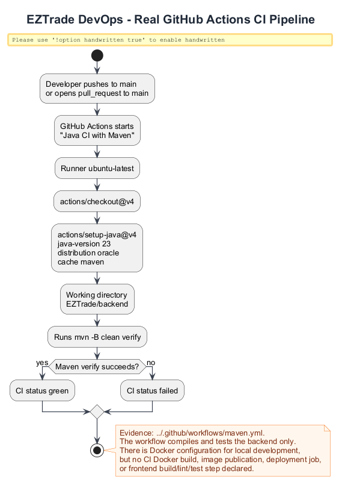
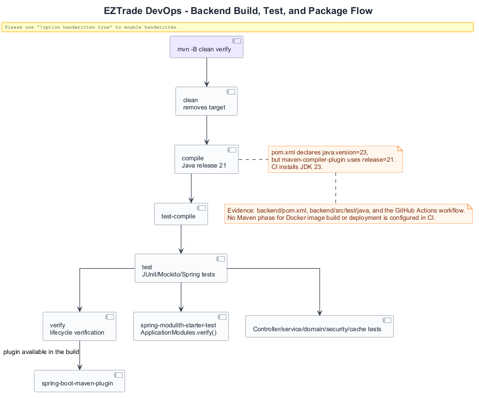
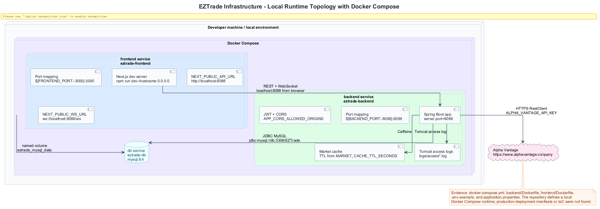
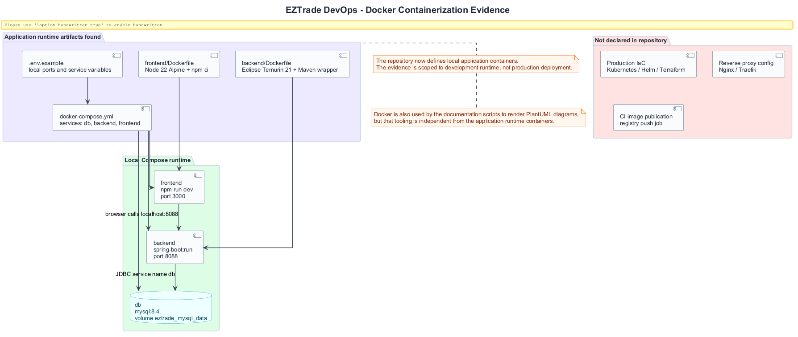
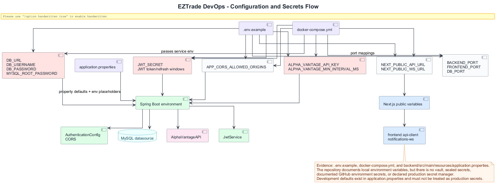
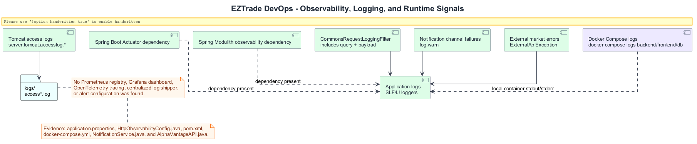

# DevOps and Infrastructure Diagrams

This section documents automation, local runtime, configuration, observability, and infrastructure limits. The evidence comes from `../.github/workflows/maven.yml`, `.env.example`, `docker-compose.yml`, Dockerfiles, `application.properties`, `backend/pom.xml`, and the search for IaC/proxy artifacts.

## CI/CD Pipeline Overview

**Purpose.** Represent the real GitHub Actions workflow.

**How to read it.** The pipeline is triggered on `push` and `pull_request` against `main`, prepares Oracle JDK 23 with Maven cache, and runs `mvn -B clean verify` in `EZTrade/backend`.

**Value.** Gives traceability for existing automation without exaggerating its scope.

**Limitation.** There is no frontend build/lint/tests, CI Docker build, image publication, or deployment.

## Build, Test, and Package Flow

**Purpose.** Break down the Maven flow verified by CI.

**How to read it.** `clean verify` compiles, runs tests, and verifies architecture. The Spring Boot plugin is present, but there is no publication or deployment phase.

**Value.** Explains the real level of automated backend assurance.

## Local Runtime Topology

**Purpose.** Show the local topology defined by Docker Compose and completed by application configuration.

**How to read it.** Compose starts `frontend`, `backend`, and `db`; the browser consumes Spring Boot at `localhost:8088`; Spring Boot uses the MySQL service `db`, Alpha Vantage, Caffeine cache, and access logs.

**Value.** Useful for the report and onboarding because it explains how local development containers communicate.

**Limitation.** The topology represents local development containers, not production infrastructure.

## Docker Containerization Evidence

**Purpose.** Document local application containerization and distinguish it from production deployment.

**How to read it.** The diagram shows `docker-compose.yml`, backend/frontend Dockerfiles, the services they start, and the production/registry artifacts that are still not declared.

**Value.** This is an honest DevOps architecture element: it recognizes local containerization without presenting it as production infrastructure.

## Configuration and Secrets Management

**Purpose.** Represent environment variables, defaults, and consumers.

**How to read it.** `.env.example` documents variables; `application.properties` defines placeholders/defaults; frontend reads `NEXT_PUBLIC_*`.

**Value.** Helps discuss configuration security and environment readiness.

**Limitation.** There is no vault, documented CI environment secrets, or declarative production secret management.

## Observability and Logging

**Purpose.** Show present operational signals.

**How to read it.** There are Tomcat access logs, request logging with payload/query, SLF4J, and Actuator/Modulith observability dependencies.

**Value.** Explains that there is a local observability base, but not a complete platform.

**Limitation.** No Prometheus, distributed traces, centralized log shipping, dashboards, or alerts were found.

## Conclusion

The current DevOps dimension is real but initial: solid backend CI, documented local Docker runtime, local configuration, and basic logs; deployment, frontend CI, CI image publication, and production observability are still missing. This reading is valuable because it turns gaps into justified technical follow-up work.
