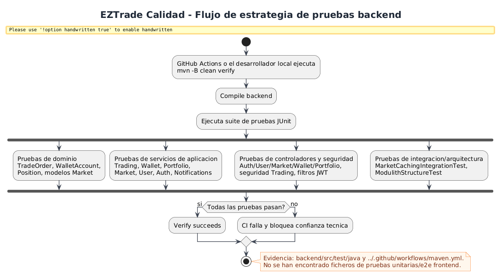
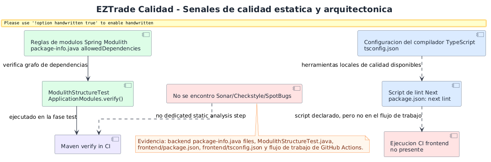
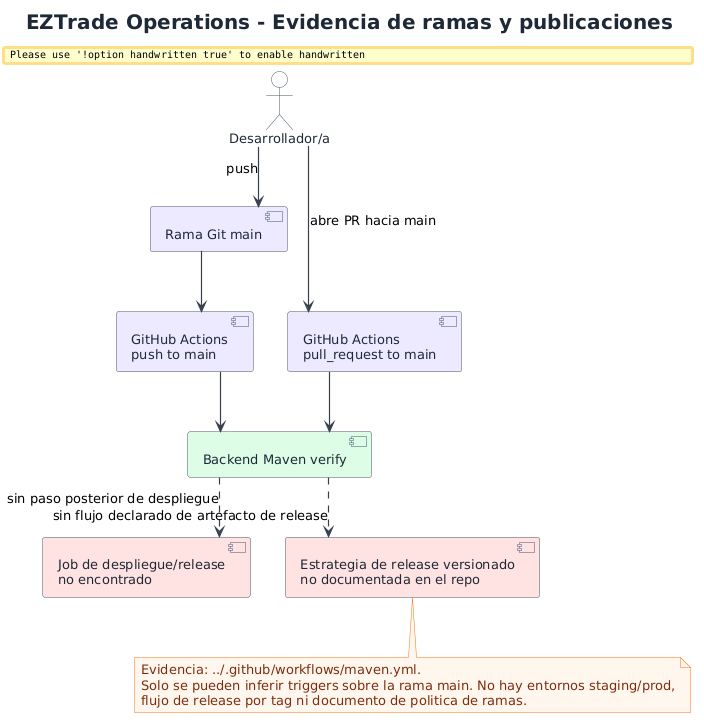
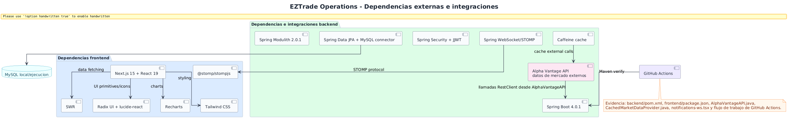

# Diagramas de calidad y operacion

Esta seccion resume pruebas, verificacion arquitectonica, alcance de calidad estatica y estrategia de publicaciones inferible. Se ha construido desde `backend/src/test/java`, `backend/pom.xml`, `frontend/package.json`, `frontend/tsconfig.json` y `../.github/workflows/maven.yml`.

## Flujo de estrategia de pruebas

**Proposito.** Mostrar que tipos de pruebas ejecuta el backend.

**Como leerlo.** El flujo Maven dispara pruebas de dominio, servicios, controladores, seguridad, cache e integracion arquitectonica.

**Valor.** Aporta una vista de aseguramiento de calidad por capas, util para justificar confianza tecnica.

**Limitacion.** No hay pruebas frontend ni e2e detectados.

## Calidad estatica y Modulith

**Proposito.** Mostrar controles de calidad estructural y huecos detectados.

**Como leerlo.** Spring Modulith verifica dependencias de modulo; TypeScript y `next lint` existen en frontend, pero el flujo de trabajo no los ejecuta.

**Valor.** Diferencia calidad arquitectonica real de comprobaciones declaradas pero no integrados.

## Evidencia de ramas y publicaciones

**Proposito.** Documentar la estrategia de ramas y publicacion que puede inferirse.

**Como leerlo.** Solo `main` aparece como rama objetivo de `push` y `pull_request`; no hay jobs de despliegue ni publicacion por tags.

**Valor.** Evita inventar GitFlow, staging o produccion cuando el repositorio no los declara.

## Dependencias externas e integraciones

**Proposito.** Resumir dependencias externas relevantes de backend, frontend y CI.

**Como leerlo.** Backend integra Spring, JPA/MySQL, JWT, WebSocket, Caffeine y Alpha Vantage. Frontend integra Next/React, SWR, STOMP, Radix/lucide, Recharts y Tailwind.

**Valor.** Sirve como mapa de riesgo y mantenimiento: cada dependencia importante queda conectada con su responsabilidad.

## Conclusion

La calidad backend esta bastante trabajada, con pruebas por capas y verificacion Modulith. La operacion y calidad frontend/DevOps tienen oportunidades claras: ejecutar lint/compilacion frontend en CI, incorporar pruebas de UI/e2e y formalizar publicaciones o despliegues cuando existan entornos reales.
